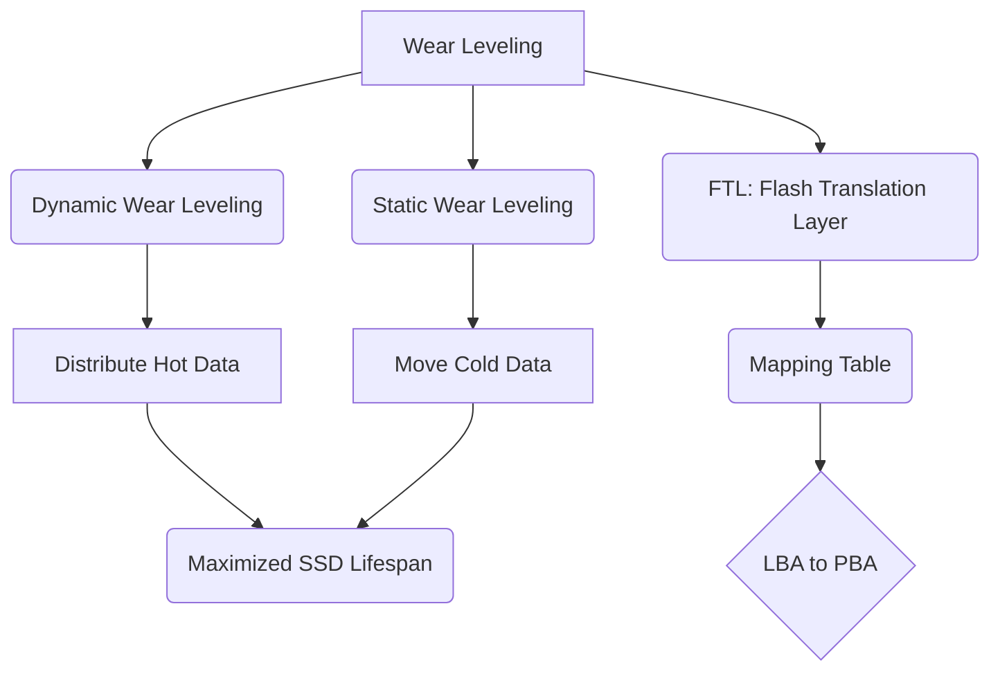

+++
title = "329. 마모 평준화 (Wear Leveling)"
weight = 329
+++

> **Insight**
> - 마모 평준화(Wear Leveling)는 SSD(Solid State Drive)와 같은 플래시 메모리(Flash Memory) 기반 저장장치의 수명을 획기적으로 연장하는 핵심 펌웨어(Firmware) 기술이다.
> - 특정 블록에 쓰기(Write) 및 지우기(Erase) 작업이 집중되는 것을 방지하여, 메모리 셀(Memory Cell)의 물리적 열화를 스토리지 전체에 균일하게 분산시킨다.
> - 동적(Dynamic) 및 정적(Static) 마모 평준화 알고리즘의 결합을 통해 데이터 보존성과 I/O 성능 간의 최적의 균형을 유지한다.

## Ⅰ. 마모 평준화(Wear Leveling)의 개요
### 1. 정의
마모 평준화(Wear Leveling)는 플래시 메모리(Flash Memory) 기반의 저장 매체에서 각 메모리 블록(Memory Block)의 P/E Cycle(Program/Erase Cycle)을 균등하게 유지하도록 데이터를 분산 기록하는 FTL(Flash Translation Layer)의 핵심 알고리즘이다. 이를 통해 특정 블록이 조기에 수명을 다하여 전체 드라이브를 사용할 수 없게 되는 현상을 방지한다.

### 2. 필요성
플래시 메모리의 셀(Cell)은 구조상 지우기(Erase) 작업 시 산화막(Oxide Layer)이 물리적으로 손상되는 열화 현상을 겪는다. 파일 시스템(File System)의 특성상 FAT(File Allocation Table)이나 메타데이터(Metadata) 영역 등 특정 LBA(Logical Block Address)에 업데이트가 집중되는 경향이 있는데, 마모 평준화 없이 해당 위치에만 쓰기를 반복하면(Hot Data) 해당 블록이 빠르게 배드 블록(Bad Block)화 된다. 따라서 디바이스 전체의 수명을 극대화하기 위해 쓰기 작업을 디바이스 전역으로 분산할 필요가 있다.

📢 **섹션 요약 비유:** 타이어를 오래 쓰기 위해 정기적으로 자동차의 앞뒤 타이어 위치를 교환(Tire Rotation)해 주는 것과 같습니다.

## Ⅱ. 핵심 아키텍처 및 동작 원리
### 1. 동작 메커니즘
마모 평준화는 기본적으로 FTL(Flash Translation Layer) 내의 매핑 테이블(Mapping Table)을 조작하여 LBA(Logical Block Address)와 PBA(Physical Block Address) 간의 연결을 동적으로 변경하는 방식으로 동작한다.

```text
+---------------------+      +---------------------+      +---------------------+
|   Host OS Request   |      |    FTL (Firmware)   |      |   NAND Flash Memory |
| (Logical LBA: 100)  | ---> | Mapping Table Update| ---> | Physical Block Array|
+---------------------+      +---------------------+      +---------------------+
                               | Erase Count Check |        | Block A (Erase: 10) |
                               +-------------------+        | Block B (Erase: 50) |
                                                            | Block C (Erase: 02) | <- New Write!
```

### 2. 세부 기술 요소
- **동적 마모 평준화 (Dynamic Wear Leveling):** 새로운 데이터가 기록될 때, 현재 지워진 빈 블록들(Free Blocks) 중에서 Erase Count(지우기 횟수)가 가장 적은 블록을 찾아 데이터를 기록한다. 이미 저장된 데이터(Cold Data)는 건드리지 않는다.
- **정적 마모 평준화 (Static Wear Leveling):** OS 파일, 미디어 파일 등 오랫동안 변경되지 않은 데이터(Cold Data)가 저장된 블록도 지속적으로 모니터링한다. Cold Data가 점유한 블록의 Erase Count가 전체 평균보다 현저히 낮을 경우, 해당 데이터를 Erase Count가 높은 블록으로 강제 이동시키고, 확보된 낮은 Erase Count 블록을 새로운 쓰기(Hot Data)용으로 개방한다.

📢 **섹션 요약 비유:** 동적 평준화가 빈 방 중 가장 깨끗한 방에 손님을 배정하는 것이라면, 정적 평준화는 장기 투숙객을 헌 방으로 옮기고 그들이 쓰던 깨끗한 방을 새 손님에게 내어주는 것과 같습니다.

## Ⅲ. 주요 기술적 특징
### 1. 장점
- **수명 극대화 (Endurance Maximization):** NAND 플래시의 제한된 P/E Cycle(SLC ~100k, MLC ~10k, TLC ~3k, QLC ~1k) 한계를 극복하고 SSD 전체의 기대 수명(TBW, Terabytes Written)을 스펙 상의 최대치까지 보장한다.
- **신뢰성 향상 (Reliability Improvement):** 조기 배드 블록 발생을 억제하여 예기치 않은 데이터 손실(Data Loss) 및 드라이브 장애(Drive Failure) 확률을 대폭 낮춘다.

### 2. 한계점 및 해결방안
- **성능 오버헤드 (Performance Overhead):** 특히 정적 마모 평준화의 경우, 데이터를 이동시키기 위해 추가적인 읽기/쓰기/지우기 작업(Write Amplification)이 발생하므로 성능 저하를 유발할 수 있다.
- **해결방안:** 최신 컨트롤러(Controller)는 디바이스가 유휴 상태(Idle State)일 때 백그라운드 작업(Background Task)으로 정적 마모 평준화 및 가비지 컬렉션(Garbage Collection)을 수행하여 사용자 체감 성능 저하를 방지한다. 오버프로비저닝(Over-provisioning) 공간을 활용하여 오버헤드를 완화한다.

📢 **섹션 요약 비유:** 짐을 이리저리 옮기느라 땀(오버헤드)을 흘리지만, 손님이 없는 밤(유휴 상태)에 미리 창고 정리를 해두어 낮 시간의 업무 효율을 유지하는 것과 같습니다.

## Ⅳ. 구현 및 응용 사례
### 1. 산업 적용 분야
- **엔터프라이즈 SSD (Enterprise SSD):** 데이터 센터(Data Center)와 서버(Server) 환경에서는 지속적이고 막대한 양의 임의 쓰기(Random Write)가 발생하므로, 정교한 마모 평준화와 대규모 오버프로비저닝이 필수적이다.
- **임베디드 시스템 (Embedded System) 및 모바일 기기:** eMMC(embedded Multi-Media Controller) 및 UFS(Universal Flash Storage) 모듈 내부에서도 배터리 소모를 최소화하면서도 플래시 수명을 연장하기 위한 마모 평준화 알고리즘이 펌웨어에 내장되어 있다.

### 2. 실제 활용 시나리오
클라우드 인프라(Cloud Infrastructure)의 데이터베이스(Database) 서버는 트랜잭션 로그(Transaction Log)를 지속적으로 기록한다. SSD 컨트롤러는 로그 파일이 기록되는 핫 데이터(Hot Data) 영역을 낸드(NAND) 전역의 블록으로 분산시켜 드라이브의 조기 고장을 방지한다.

📢 **섹션 요약 비유:** 24시간 쉴 새 없이 돌아가는 거대한 택배 물류센터(데이터 센터)에서 컨베이어 벨트(낸드 블록)의 특정 구간만 마모되지 않도록 물류 경로를 끊임없이 최적화하는 것과 같습니다.

## Ⅴ. 발전 동향 및 미래 전망
### 1. 최신 트렌드
- **AI 기반 핫/콜드 데이터 분류:** 최근의 최상위 스토리지 컨트롤러는 머신러닝(Machine Learning) 기법을 활용하여 데이터의 접근 패턴을 예측하고, 핫 데이터와 콜드 데이터를 더욱 정밀하게 분류하여 마모 평준화 효율을 높이고 쓰기 증폭(Write Amplification)을 최소화한다.
- **QLC 및 PLC 시대의 중요성 부각:** 셀당 4비트(QLC, Quad-Level Cell) 또는 5비트(PLC, Penta-Level Cell)를 저장하는 고밀도 낸드의 경우 P/E Cycle이 매우 적기 때문에, 생존을 위해 극도로 고도화된 마모 평준화 및 LDPC(Low-Density Parity-Check) 에러 정정 알고리즘이 결합되어 사용된다.

### 2. 차세대 기술 연계
차세대 인터페이스인 NVMe(Non-Volatile Memory Express) 프로토콜의 ZNS(Zoned Namespaces) 기능은 호스트(Host OS)가 플래시의 물리적 특성을 이해하고 데이터를 순차적으로 기록하도록 유도함으로써, SSD 펌웨어 수준의 복잡한 마모 평준화 부담을 줄이고 전체 스토리지 효율을 향상시킨다.

📢 **섹션 요약 비유:** 미래에는 인공지능(AI) 지휘자가 각 악기(메모리 셀)의 피로도를 미리 예측하고 완벽한 교향곡(데이터 저장)을 연주하도록 지휘하는 것과 같습니다.

---

### 💡 Knowledge Graph & Child Analogy

- **Child Analogy**: 스케치북의 첫 페이지만 계속 지우고 다시 그리면 종이가 금방 찢어지겠지? 마모 평준화는 스케치북의 모든 페이지를 골고루 한 번씩 사용하도록 안내해주는 똑똑한 선생님과 같단다. 그래야 스케치북 한 권을 끝까지 깨끗하게 다 쓸 수 있거든.
