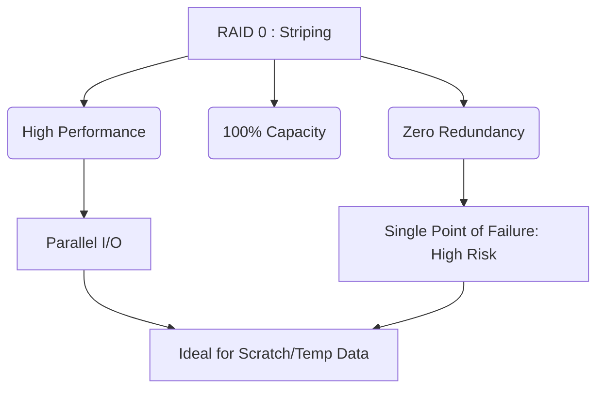

+++
title = "332. RAID 0 (스트라이핑)"
weight = 332
+++

> **Insight**
> - RAID 0(Redundant Array of Independent Disks 0)은 데이터 스트라이핑(Data Striping) 기법을 사용하여 여러 디스크에 데이터를 분산 저장함으로써 I/O 성능을 극대화하는 아키텍처이다.
> - 이름에 'Redundant(중복)'가 포함된 RAID 규격 중 유일하게 데이터 중복성(Redundancy)이나 결함 허용(Fault Tolerance)을 제공하지 않는다.
> - 용량과 속도를 얻는 대신 신뢰성을 완전히 포기하는 구조이므로, 단일 디스크 고장 시 전체 데이터가 손실(Data Loss)되는 치명적인 위험성을 내포하고 있다.

## Ⅰ. RAID 0 (스트라이핑)의 개요
### 1. 정의
RAID 0는 두 개 이상의 물리적 디스크(Physical Disk)를 하나의 논리적 볼륨(Logical Volume)으로 묶고, 데이터를 일정한 크기의 블록(Block) 또는 청크(Chunk)로 분할하여 각 디스크에 순차적으로 번갈아 가며 저장(Striping)하는 스토리지 구성 방식이다. 

### 2. 필요성
단일 디스크 드라이브의 순차 읽기/쓰기 성능 한계 및 대역폭(Bandwidth) 병목 현상을 극복하기 위해 등장했다. 특히, 비디오 편집, 대규모 임시 파일(Scratch Disk) 처리, 렌더링(Rendering) 등 대용량 데이터를 초고속으로 지속적으로 읽고 써야 하는 환경에서 극한의 성능이 요구될 때 필수적으로 채택된다.

📢 **섹션 요약 비유:** 한 명의 일꾼이 무거운 짐을 혼자 나르는 대신, 여러 명의 일꾼이 짐을 잘게 나누어 동시에 나름으로써 작업 속도를 비약적으로 높이는 것과 같습니다.

## Ⅱ. 핵심 아키텍처 및 동작 원리
### 1. 동작 메커니즘
호스트(Host OS)로부터 데이터 쓰기 요청이 들어오면, RAID 컨트롤러(Hardware/Software)는 데이터를 설정된 스트라이프 크기(Stripe Size, 예: 64KB, 128KB)로 쪼갠 후, 디스크 1, 디스크 2, 디스크 3... 에 병렬로 분산하여 기록한다.

```text
Host Data: [ A, B, C, D, E, F ]

+-----------+  +-----------+  +-----------+
|  Disk 0   |  |  Disk 1   |  |  Disk 2   |
+-----------+  +-----------+  +-----------+
| Block A   |  | Block B   |  | Block C   |
| Block D   |  | Block E   |  | Block F   |
+-----------+  +-----------+  +-----------+
```

### 2. 세부 기술 요소
- **스트라이프 크기 (Stripe Size / Chunk Size):** 한 디스크에 연속적으로 쓰이는 데이터의 양을 결정한다. 대용량 순차 작업에는 큰 스트라이프 크기가 유리하고, 작은 파일의 랜덤 I/O 작업에는 작은 크기가 유리할 수 있으나, 어플리케이션 특성에 맞는 튜닝이 필수적이다.
- **병렬 처리 (Parallel Processing):** 데이터가 여러 디스크에 걸쳐 있으므로, 읽기 작업 시 여러 디스크의 헤드(HDD의 경우)나 컨트롤러(SSD의 경우)가 동시에 데이터를 읽어 올려 시스템 버스(System Bus)의 한계점까지 처리량을 끌어올린다.

📢 **섹션 요약 비유:** 긴 소설책을 타이핑할 때, 3명의 타자수가 1페이지, 2페이지, 3페이지를 각각 나누어 동시에 타이핑하여 3배 빨리 책을 완성하는 것과 같습니다.

## Ⅲ. 주요 기술적 특징
### 1. 장점
- **최고의 성능 (Highest Performance):** 디스크가 $N$개일 때, 이론상 읽기와 쓰기 속도가 모두 단일 디스크 대비 $N$배 향상된다. (오버헤드를 제외하면 거의 선형적으로 증가)
- **100% 용량 활용 (100% Capacity Utilization):** 패리티(Parity) 연산이나 미러링(Mirroring)을 위한 예비 공간이 필요 없으므로, 구성된 모든 디스크 용량의 합을 온전히 데이터 저장에 사용할 수 있다.

### 2. 한계점 및 해결방안
- **무결성 및 내결함성 부재 (Zero Fault Tolerance):** 디스크 배열 중 단 하나의 디스크만 고장(Failure)나도, 스트라이핑 된 데이터 조각의 이빨이 빠지게 되어 논리적 볼륨 전체의 데이터가 파괴된다. 디스크 개수가 많아질수록 전체 시스템의 고장 확률(MTBF 감소)은 기하급수적으로 높아진다.
- **해결방안:** RAID 0는 데이터 보존이 목적이 아니므로, 정기적인 백업(Backup)을 철저히 하거나, 잃어버려도 다시 생성할 수 있는 임시 데이터(Cache, Temp Files) 용도로만 사용해야 한다. 안전성을 보완하려면 RAID 10(1+0) 등의 혼합 구성을 고려해야 한다.

📢 **섹션 요약 비유:** 여러 대의 스포츠카를 밧줄로 묶어 동시에 끌어 엄청난 속도를 내지만, 차 한 대만 바퀴가 빠져도 전체 대열이 대형 사고로 이어지는 아슬아슬한 폭주와 같습니다.

## Ⅳ. 구현 및 응용 사례
### 1. 산업 적용 분야
- **미디어 및 엔터테인먼트:** 4K/8K 고해상도 비디오 편집 워크스테이션, 3D 렌더링 농장(Render Farm) 등 순차 I/O 대역폭이 절대적인 분야.
- **고성능 컴퓨팅 (HPC):** 빠른 계산 결과를 일시적으로 저장해야 하는 슈퍼컴퓨터의 스크래치 스페이스(Scratch Space).

### 2. 실제 활용 시나리오
최근에는 여러 개의 NVMe M.2 SSD를 메인보드나 확장 카드 수준에서 하드웨어/소프트웨어 RAID 0로 묶어 10GB/s 이상의 초고속 로컬 스토리지를 구축, 고사양 게이밍(Gaming) 로딩 시간 단축이나 대규모 AI 모델의 학습용 데이터 셋(Dataset) 고속 로딩에 활용하기도 한다.

📢 **섹션 요약 비유:** 방송국의 실시간 영상 편집실에서 수백 기가의 원본 영상을 버퍼링 없이 즉각적으로 불러오기 위해 속도에 모든 것을 "몰빵"한 작업 환경과 같습니다.

## Ⅴ. 발전 동향 및 미래 전망
### 1. 최신 트렌드
- **NVMe RAID의 부상:** 과거 HDD 시절의 느린 속도를 보완하기 위해 주로 쓰였으나, 최근에는 초고속 PCIe 기반의 NVMe SSD들조차 한계 대역폭을 뚫기 위해 VROC(Virtual RAID on CPU) 등의 기술을 통해 소프트웨어/하드웨어 혼합 RAID 0로 구성되는 추세이다.
- **소프트웨어 RAID (Software RAID)의 대중화:** 현대의 멀티코어 CPU는 성능이 워낙 뛰어나기 때문에, 고가의 전용 하드웨어 RAID 카드 없이도 OS(Windows Storage Spaces, Linux mdadm, macOS Disk Utility) 차원에서 충분히 뛰어난 RAID 0 성능을 구현할 수 있다.

### 2. 차세대 기술 연계
네트워크 스토리지 아키텍처에서 NVMe-oF(NVMe over Fabrics) 환경에서 여러 타겟 스토리지의 LUN을 클라이언트에서 분산 스트라이핑하여 단일 노드의 한계를 넘어서는 분산 RAID 0(클러스터 스토리지 계층) 기술로 진화하고 있다.

📢 **섹션 요약 비유:** 과거에는 일반 도로에서 차 여러 대를 연결해 달렸다면, 미래에는 자기부상열차 여러 대를 이어 붙여 음속을 돌파하려는 극한의 스피드 추구와 같습니다.

---

### 💡 Knowledge Graph & Child Analogy

- **Child Analogy**: 레고 블록으로 큰 성을 만들 때, 친구들 4명이 성벽의 각기 다른 부분을 동시에 조립(스트라이핑)하면 엄청 빨리 완성할 수 있어. 하지만 친구 한 명이라도 집에 가버리면(디스크 고장) 그 부분에 구멍이 뻥 뚫려서 성 전체가 무너지게 되는 위험한 조립 방식이야.
