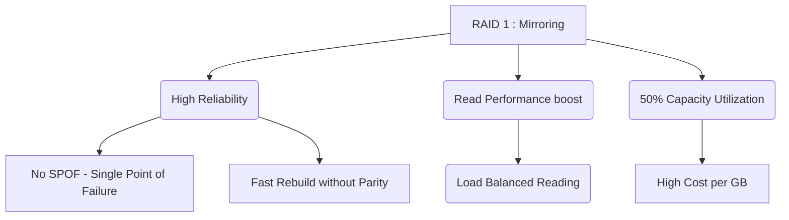

+++
title = "333. RAID 1 (미러링)"
weight = 333
+++

> **Insight**
> - RAID 1(Redundant Array of Independent Disks 1)은 동일한 데이터를 둘 이상의 디스크에 실시간으로 복제하는 미러링(Mirroring) 기법을 사용하여 데이터의 안정성을 극대화하는 스토리지 구성이다.
> - 높은 수준의 결함 허용(Fault Tolerance)과 데이터 무결성(Data Integrity)을 제공하여 시스템의 고가용성(High Availability, HA)을 보장한다.
> - 스토리지 용량 효율은 전체 물리 디스크의 50%(2개 구성 시)로 가장 낮지만, 재난 복구(Disaster Recovery) 관점에서는 가장 직관적이고 확실한 방법이다.

## Ⅰ. RAID 1 (미러링)의 개요
### 1. 정의
RAID 1은 데이터를 저장할 때 원본 디스크(Primary Disk)와 완전히 동일한 복사본을 거울처럼 백업 디스크(Mirror Disk)에 동시에 기록(Write)하는 아키텍처이다. 두 개의 물리적 디스크가 하나의 논리적 드라이브로 운영체제(OS)에 인식된다.

### 2. 필요성
기업의 운영 서버, 데이터베이스, 회계 시스템 등 절대 유실되어서는 안 되는(Mission Critical) 데이터를 보호하기 위해 고안되었다. 하드 드라이브(HDD)나 SSD의 물리적 결함(Mechanical Failure, Bad Sectors)은 언제든 발생할 수 있으므로, 단일 장애점(SPOF, Single Point of Failure)을 제거하여 서비스의 무중단 운영을 가능하게 한다.

📢 **섹션 요약 비유:** 중요한 문서를 작성할 때, 언제든 원본을 잃어버릴까 봐 복사기(미러링)를 이용해 똑같은 사본을 실시간으로 다른 금고에 보관해 두는 것과 같습니다.

## Ⅱ. 핵심 아키텍처 및 동작 원리
### 1. 동작 메커니즘
호스트(Host OS)에서 쓰기(Write) 명령을 내리면 RAID 컨트롤러는 디스크 0과 디스크 1에 동일한 데이터를 중복해서 기록한다. 읽기(Read) 명령이 발생하면 컨트롤러의 알고리즘에 따라 두 디스크 중 접근 속도가 빠른 곳에서 데이터를 읽어오거나 분산해서 읽어올 수 있다.

```text
Host Data: [ A, B, C ]

        +--- (Write A) ---> [ Block A | Block B | Block C ] (Disk 0)
        |
Host ---+
        |
        +--- (Write A) ---> [ Block A | Block B | Block C ] (Disk 1)
```

### 2. 세부 기술 요소
- **동시 쓰기 (Simultaneous Write):** 쓰기 작업은 모든 미러 디스크에 데이터 기록이 완료되어야(Commit) 호스트에 완료 신호를 보낸다. 따라서 가장 느린 디스크의 쓰기 속도에 전체 쓰기 성능이 동기화된다.
- **분산 읽기 (Split Seek / Load Balancing):** 고급 하드웨어 RAID 컨트롤러의 경우, 두 개의 디스크가 서로 다른 데이터를 동시에 읽어오도록 지시하여(예: 디스크 0은 앞부분, 디스크 1은 뒷부분) 이론상 읽기 성능을 단일 디스크 대비 두 배 가량 향상시킬 수 있다.

📢 **섹션 요약 비유:** 두 명의 직원이 같은 장부를 동시에 작성(동시 쓰기)하느라 시간이 조금 걸리지만, 나중에 기록을 찾을 때는 두 사람이 각자 반씩 나누어 찾아보면(분산 읽기) 두 배 빨리 찾을 수 있는 것과 같습니다.

## Ⅲ. 주요 기술적 특징
### 1. 장점
- **최상의 결함 허용 (Excellent Fault Tolerance):** 2개의 디스크로 구성된 RAID 1 환경에서는 1개의 디스크가 완전히 파손되더라도 서비스 중단 없이 남은 디스크로 정상 동작을 유지한다. (Degraded Mode)
- **빠른 복구 (Fast Rebuild):** 패리티(Parity) 연산을 사용하는 다른 RAID 레벨(RAID 5, 6)과 달리, 복잡한 계산 없이 새 디스크를 꽂으면 단순히 남은 디스크의 내용을 1:1로 블록 복사(Block Copy)만 하면 되므로 리빌드(Rebuild) 속도가 매우 빠르고 CPU 오버헤드가 적다.

### 2. 한계점 및 해결방안
- **낮은 공간 효율 (Low Storage Efficiency):** 데이터 중복 저장으로 인해 구매한 전체 물리 용량의 정확히 절반(50%)만 사용할 수 있다. 저장해야 할 데이터가 테라바이트(TB), 페타바이트(PB) 단위로 커질수록 막대한 비용 낭비(Cost Inefficiency)를 초래한다.
- **해결방안:** 비용 효율과 성능, 안전성을 모두 타협하기 위해 엔터프라이즈 환경에서는 RAID 1을 단독으로 쓰기보다는, RAID 1로 묶인 쌍을 여러 개 스트라이핑하는 RAID 10(1+0)이나 용량 효율이 높은 RAID 5/6을 용도에 맞게 분리하여 채택한다.

📢 **섹션 요약 비유:** 가장 안전한 자물쇠를 얻었지만, 창고 공간의 절반을 오직 예비 부품을 보관하는 데에만 써야 해서 창고 임대료(비용)가 두 배로 드는 단점이 있습니다.

## Ⅳ. 구현 및 응용 사례
### 1. 산업 적용 분야
- **운영 체제(OS) 영역:** 서버 시스템의 메인 운영체제가 설치되는 C 드라이브(또는 root 파티션)는 안정적인 부팅과 시스템 파일 보호가 최우선이므로 주로 하드웨어 RAID 1로 구성된다.
- **중소규모 데이터베이스 (SMB Database):** 트랜잭션 기록이 중요하고 절대적인 용량보다는 높은 무결성이 요구되는 소규모 회계/ERP DB의 저장소.

### 2. 실제 활용 시나리오
서버 관리자는 핫 스왑(Hot Swap)을 지원하는 섀시(Chassis)에 디스크를 장착한다. 새벽에 디스크 0번에서 물리적 배드 섹터로 인한 장애가 발생하더라도, 시스템은 디스크 1번을 통해 무중단으로 계속 서비스를 제공한다. 관리자는 아침에 출근하여 고장 난 디스크를 새 것으로 교체하기만 하면, RAID 컨트롤러가 자동으로 백그라운드에서 데이터를 복제(Rebuild)하여 다시 완전한 RAID 1 상태로 복구한다.

📢 **섹션 요약 비유:** 비행기에 엔진이 두 개(RAID 1) 있어서, 비행 도중 엔진 하나가 고장 나더라도 무사히 목적지까지 날아가서 수리받을 수 있는 것과 같은 이치입니다.

## Ⅴ. 발전 동향 및 미래 전망
### 1. 최신 트렌드
- **NVMe 기반 소프트웨어 미러링:** ZFS, Btrfs 같은 현대적인 파일 시스템은 자체적인 소프트웨어 미러링 기능을 제공하며, 체크섬(Checksum)을 통해 RAID 하드웨어 컨트롤러가 잡지 못하는 조용한 데이터 손상(Silent Data Corruption, Bit Rot)까지 스스로 감지하고 미러 디스크에서 원본을 복원해내는 자가 치유(Self-Healing) 능력을 보여준다.

### 2. 차세대 기술 연계
클라우드 컴퓨팅 환경에서는 단일 서버 내의 디스크 미러링(RAID 1)을 넘어서, 네트워크를 통해 지리적으로 떨어진 다른 데이터센터의 스토리지와 실시간으로 블록 데이터를 복제하는 네트워크 미러링(예: DRBD, 원격 동기화) 개념으로 확장되어 가용성 영역(Availability Zone, AZ) 단위의 이중화 아키텍처로 진화하고 있다.

📢 **섹션 요약 비유:** 예전에는 같은 건물 안에 금고 두 개를 두었다면, 미래에는 해일이나 지진에 대비해 아예 다른 도시에 똑같은 내용물이 복제되는 마법 금고를 두는 방식으로 스케일이 커지고 있습니다.

---

### 💡 Knowledge Graph & Child Analogy

- **Child Analogy**: 중요한 그림 일기를 쓸 때마다 똑같은 일기장 두 권을 펼쳐놓고 양손으로 똑같이 그리는 거야. 만약 한 권이 물에 젖어 망가지더라도, 멀쩡한 나머지 한 권이 있으니까 내 소중한 일기를 안전하게 지킬 수 있지! 대신 일기장 살 돈은 두 배로 든다는 게 흠이야.
