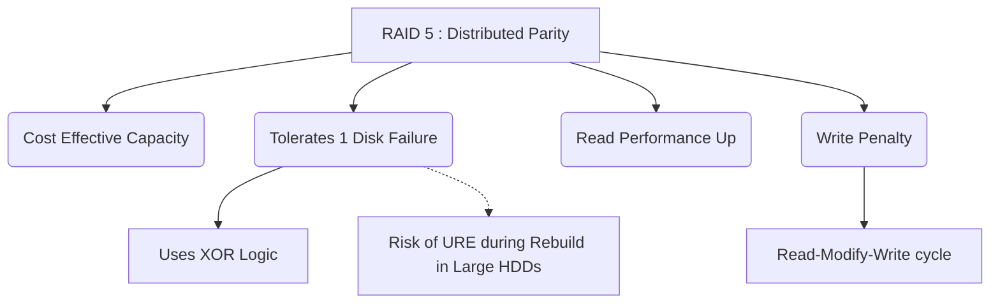

+++
title = "334. RAID 5 (분산 패리티)"
weight = 334
+++

> **Insight**
> - RAID 5(Redundant Array of Independent Disks 5)는 3개 이상의 디스크를 스트라이핑(Striping) 방식으로 연결하되, 데이터 복구를 위한 패리티(Parity) 정보를 모든 디스크에 분산 저장(Distributed Parity)하는 스토리지 아키텍처이다.
> - 저장 공간의 효율성(Storage Efficiency), 준수한 읽기 성능, 그리고 1개의 디스크 장애에 대한 결함 허용(Fault Tolerance)이라는 세 마리 토끼를 적절히 타협한 가장 대중적인 엔터프라이즈 RAID 레벨이다.
> - 패리티 연산에 따른 쓰기 패널티(Write Penalty)가 존재하며, 리빌드(Rebuild) 과정 중 추가 디스크 고장 시 데이터가 영구 손실되는 URE(Unrecoverable Read Error) 위험성을 안고 있다.

## Ⅰ. RAID 5 (분산 패리티)의 개요
### 1. 정의
RAID 5는 최소 3개의 하드 디스크 드라이브(HDD) 또는 SSD를 요구하며, 데이터 블록과 오류 정정을 위한 패리티(Parity) 블록을 특정 알고리즘(XOR 연산)을 통해 모든 디스크에 번갈아 가며 고르게 분산 저장하는 기술이다.

### 2. 필요성
RAID 1(미러링)의 낮은 용량 효율성(50%)이라는 경제적 단점과 RAID 0(스트라이핑)의 치명적인 안정성 결여를 동시에 극복하기 위해 등장했다. 전체 디스크 중 단 1개 분량의 용량만 패리티 데이터 보존에 사용하면서도, 디스크 1개의 물리적 장애를 버텨낼 수 있는 가성비 높은 안정성을 제공한다.

📢 **섹션 요약 비유:** 3명이 모여 비밀문서를 1/3씩 나누어 가지면서, 동시에 각자 다른 사람의 문서 요약본(패리티)을 조각내어 보관함으로써, 한 명이 사라져도 남은 두 명의 요약본을 합쳐 사라진 원본을 완벽히 복원해내는 협동 작전과 같습니다.

## Ⅱ. 핵심 아키텍처 및 동작 원리
### 1. 동작 메커니즘
데이터는 RAID 0처럼 블록 단위로 여러 디스크에 스트라이핑된다. 이때, 특정 데이터 블록들에 대한 배타적 논리합(XOR) 연산을 수행하여 패리티 블록(P)을 생성하고, 병목 현상을 막기 위해 이 패리티 블록을 한 디스크에 몰아넣지 않고 각 디스크에 순환 이동하며(Distributed) 저장한다.

```text
Host Data: [ A, B, C, D, E, F ]  (최소 3개 디스크 기준 예시)

+-----------+  +-----------+  +-----------+
|  Disk 0   |  |  Disk 1   |  |  Disk 2   |
+-----------+  +-----------+  +-----------+
| Block A1  |  | Block A2  |  | Parity A  | <- Stripe 1 (Parity on Disk2)
| Block B1  |  | Parity B  |  | Block B2  | <- Stripe 2 (Parity on Disk1)
| Parity C  |  | Block C1  |  | Block C2  | <- Stripe 3 (Parity on Disk0)
+-----------+  +-----------+  +-----------+
* XOR 연산의 원리: A1 ⊕ A2 = Parity A. 만약 A1이 유실되면, Parity A ⊕ A2 = A1 으로 복원 가능.
```

### 2. 세부 기술 요소
- **XOR (Exclusive OR) 연산 엔진:** 하드웨어 RAID 카드 내부에 장착된 전용 프로세서(ASIC 또는 ROC)가 실시간으로 XOR 비트 연산을 수행하여 패리티를 계산한다. 이를 통해 CPU 부하를 경감시킨다.
- **분산 패리티 (Distributed Parity):** 과거 RAID 3나 4는 패리티를 단일 전용 디스크에만 저장하여 쓰기 작업 시 해당 패리티 디스크에 병목(Bottleneck)이 발생하는 치명적 단점이 있었다. RAID 5는 패리티를 모든 디스크에 골고루 분산하여 이 병목 현상을 해소했다.

📢 **섹션 요약 비유:** 은행 창구가 3개인데, 과거엔 도장 찍어주는 결재 창구(전용 패리티 디스크)를 1개만 두어 줄이 길어졌다면, 이제는 3개 창구 직원이 돌아가며 번갈아 도장을 찍어주어(분산 패리티) 대기줄을 없앤 것과 같습니다.

## Ⅲ. 주요 기술적 특징
### 1. 장점
- **우수한 용량 효율 (High Capacity Efficiency):** 총 디스크 개수가 $N$개일 때, 사용 가능한 실제 용량은 $(N-1) \times \text{가장 작은 디스크 용량}$ 이다. 예를 들어 4TB 디스크 4개를 묶으면 $3 \times 4\text{TB} = 12\text{TB}$ 를 사용할 수 있어 용량 대비 가성비가 매우 뛰어나다.
- **높은 읽기 성능 (Good Read Performance):** 데이터가 여러 디스크에 스트라이핑 되어 있으므로 읽기 I/O 요청을 병렬로 처리하여 뛰어난 읽기 성능을 발휘한다.

### 2. 한계점 및 해결방안 (Write Penalty & URE Risk)
- **쓰기 페널티 (Write Penalty):** 하나의 블록을 수정(Update)하기 위해서는 '기존 데이터 읽기 → 기존 패리티 읽기 → 새 패리티 계산(XOR) → 새 데이터 쓰기 → 새 패리티 쓰기' 의 복잡한 과정(Read-Modify-Write)을 거쳐야 한다. 이로 인해 임의 쓰기(Random Write) 성능이 크게 저하된다.
- **URE(Unrecoverable Read Error)와 리빌드 실패 위험:** 1개의 디스크가 고장 나서 남은 디스크를 맹렬하게 읽어 데이터를 복구(Rebuild)하는 과정 중에, 남은 디스크 중 하나에서 배드 섹터(URE)가 발견되거나 스트레스로 인해 추가 고장이 발생하면 볼륨 전체가 파괴된다. 디스크 용량이 커진 현대(수십 TB)에는 리빌딩 시간이 길어져 이 2차 고장 확률이 기하급수적으로 높아졌다.
- **해결방안:** 배터리 백업 캐시(BBU)가 있는 고성능 RAID 카드를 사용하여 쓰기 페널티를 완화한다. 대용량 디스크 사용 환경에서는 안전성을 위해 점차 RAID 6(이중 패리티) 또는 RAID 10으로 마이그레이션하는 추세이다.

📢 **섹션 요약 비유:** 읽을 때는 여러 권의 책을 동시에 읽어 빠르지만, 글자를 한 줄 고쳐 쓰려면 원본을 지우고, 요약본도 찾아 지운 다음, 새로 머리를 굴려 요약본을 다시 써야 하는 번거로움(쓰기 페널티)이 있습니다.

## Ⅳ. 구현 및 응용 사례
### 1. 산업 적용 분야
- **파일 서버 (File Server) 및 웹 서버:** 쓰기 작업보다는 클라이언트에게 파일이나 웹 페이지를 제공하는 읽기(Read) 비중이 압도적으로 높은 환경에 최적화되어 있다.
- **아카이빙 및 영상 감시 저장소:** CCTV 녹화 데이터 저장장치나 장기 보존용 백업 저장소(NAS)처럼 대용량이 필요하면서도 최소한의 물리적 장애 대비책이 필요한 곳에 널리 쓰인다.

### 2. 실제 활용 시나리오
중소기업의 4베이(Bay) NAS 스토리지 장비에서 4TB HDD 4개를 RAID 5로 묶어 총 12TB의 공유 폴더 공간을 구축한다. 직원들이 문서를 공유하다가 3번 슬롯의 하드디스크에 빨간불(장애)이 들어와도 서버는 멈추지 않고 계속 작동하며(물론 성능은 다소 저하됨), 관리자는 업무 시간 이후 새 디스크를 꽂아 리빌딩을 진행한다.

📢 **섹션 요약 비유:** 중소규모 회사에서 비싼 임대료(비용)를 아끼기 위해 창고 공간을 최대로 확보하면서도, 도둑이 들어 한 칸을 털어가도 금방 복구할 수 있는 아주 경제적이고 합리적인 창고 운영 방식과 같습니다.

## Ⅴ. 발전 동향 및 미래 전망
### 1. 최신 트렌드
- **대용량 드라이브의 등장과 RAID 5의 위기:** 20TB를 상회하는 고용량 HDD가 보편화되면서, 디스크 장애 시 리빌드(Rebuild)에 소요되는 시간이 수일(Days)에서 심하면 주(Weeks) 단위로 길어졌다. 이 기간 동안 2번째 디스크가 고장 날 확률이 치명적으로 높아져, IT 업계에서는 "대용량 드라이브에서 RAID 5는 더 이상 안전하지 않다(RAID 5 is Dead)"는 인식이 퍼지고 있다.

### 2. 차세대 기술 연계
순수 하드웨어 RAID 5는 점차 도태되고, ZFS의 RAID-Z1이나 이레이저 코딩(Erasure Coding, EC) 기술을 접목한 분산 객체 스토리지(Ceph, AWS S3 등) 아키텍처로 진화하고 있다. 이레이저 코딩은 RAID 5의 패리티 개념을 네트워크 분산 노드 레벨로 확장하여 데이터 조각을 재구성하는 차세대 데이터 보호 기술이다.

📢 **섹션 요약 비유:** 과거 100kg짜리 짐을 나를 때는 괜찮았지만, 이제 10톤짜리 거대한 짐(대용량 HDD)을 나르다 한 명이 쓰러지면 남은 사람들이 버티는 시간이 너무 길어져 다 같이 무너질 위험이 커졌기 때문에, 더 튼튼한 방식(RAID 6)으로 옮겨가는 추세입니다.

---

### 💡 Knowledge Graph & Child Analogy

- **Child Analogy**: 친구 3명이서 퍼즐 맞추기를 하는데, 각자 자기 퍼즐 조각을 가지면서 동시에 '옆 친구 퍼즐의 힌트(패리티)'도 쪽지에 적어서 나누어 가졌어. 만약 한 친구가 퍼즐을 잃어버려도 남은 친구들이 가진 힌트를 조합하면 잃어버린 퍼즐 모양을 알아내서 다시 그릴 수 있는 아주 똑똑하고 경제적인 방법이야!
