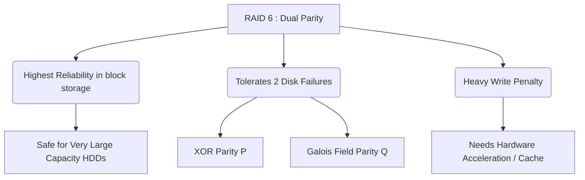

+++
title = "335. RAID 6 (이중 패리티)"
weight = 335
+++

> **Insight**
> - RAID 6(Redundant Array of Independent Disks 6)는 RAID 5의 아키텍처를 확장하여, 두 개의 서로 다른 알고리즘으로 계산된 독립적인 패리티(Dual Parity)를 분산 저장하는 기술이다.
> - 동시에 2개의 물리적 디스크 고장(Double Disk Failure)이 발생해도 데이터 무결성을 보장하며, 대용량 디스크 환경에서 1차 디스크 복구(Rebuild) 중 발생할 수 있는 2차 고장의 공포(URE)를 해소한다.
> - 이중 연산으로 인해 RAID 5 대비 쓰기 페널티(Write Penalty)가 더 가중되며, 2개 디스크 분량의 용량을 패리티 스페이스로 할당해야 하는 제약이 있다.

## Ⅰ. RAID 6 (이중 패리티)의 개요
### 1. 정의
RAID 6은 최소 4개의 디스크 드라이브로 구성되며, 데이터를 스트라이핑하면서 블록 묶음당 두 개의 패리티 정보(일반적으로 P 패리티와 Q 패리티)를 생성하여 모든 디스크에 분산 기록하는 고신뢰성 스토리지 구성 방식이다.

### 2. 필요성
하드 디스크 용량이 수 테라바이트(TB)에서 수십 테라바이트로 커짐에 따라, 디스크 장애 발생 시 데이터 리빌딩(Rebuilding)에 걸리는 시간이 폭발적으로 증가했다. RAID 5 환경에서는 수십 시간의 리빌드 중에 남은 디스크 하나가 스트레스로 인해 추가로 고장(Unrecoverable Read Error, URE) 나면 전체 데이터를 잃게 되는 심각한 위험이 대두되었다. 이를 방어하기 위해 '두 개의 디스크가 동시에 죽어도 버틸 수 있는' RAID 6가 엔터프라이즈 환경의 표준으로 자리 잡게 되었다.

📢 **섹션 요약 비유:** 줄타기 곡예사가 만약의 추락을 대비해 안전그물(RAID 5)을 하나 쳐두었는데, 그물이 찢어질 확률까지 고려하여 더 질긴 두 번째 안전그물(이중 패리티)을 그 아래에 하나 더 겹쳐서 설치한 것과 같습니다.

## Ⅱ. 핵심 아키텍처 및 동작 원리
### 1. 동작 메커니즘
데이터를 블록으로 나누고, 두 가지 복잡한 수학적 연산을 통해 두 개의 별도 패리티 블록(Parity P, Parity Q)을 생성한다. 생성된 데이터와 P, Q 블록은 병목 현상을 막기 위해 모든 디스크를 순회하며 분산 저장된다.

```text
Host Data: [ A, B, C, D ]  (최소 4개 디스크 기준 예시)

+-----------+  +-----------+  +-----------+  +-----------+
|  Disk 0   |  |  Disk 1   |  |  Disk 2   |  |  Disk 3   |
+-----------+  +-----------+  +-----------+  +-----------+
| Block A1  |  | Block A2  |  | Parity P1 |  | Parity Q1 | <- Stripe 1 (P/Q on D2, D3)
| Block B1  |  | Parity P2 |  | Parity Q2 |  | Block B2  | <- Stripe 2 (P/Q on D1, D2)
| Parity P3 |  | Parity Q3 |  | Block C1  |  | Block C2  | <- Stripe 3 (P/Q on D0, D1)
+-----------+  +-----------+  +-----------+  +-----------+
* P1 = XOR 연산 패리티 (RAID 5와 동일)
* Q1 = 갈루아 필드(Galois Field) 등 복잡한 다항식 기반의 2차 패리티
```

### 2. 세부 기술 요소
- **갈루아 체(Galois Field) 연산:** 첫 번째 패리티(P)는 단순 XOR 연산을 사용하지만, 두 번째 패리티(Q)는 두 개의 디스크가 동시에 소실되었을 때 역산이 가능하도록 갈루아 체($GF(2^8)$) 대수학 기반의 복잡한 행렬 곱셈을 수행한다.
- **하드웨어 가속기 필수:** Q 패리티를 실시간으로 계산하는 것은 CPU에 극심한 연산 부하를 주므로, 강력한 전용 프로세서가 탑재된 고가의 하드웨어 RAID 컨트롤러 장비가 필수적으로 요구된다.

📢 **섹션 요약 비유:** 첫 번째 자물쇠는 단순한 비밀번호(XOR)로 채우고, 두 번째 자물쇠는 복잡한 수학 공식으로 풀리는 지문 인식(갈루아 연산)을 적용해 보안을 이중으로 강화한 금고와 같습니다.

## Ⅲ. 주요 기술적 특징
### 1. 장점
- **극강의 데이터 생존성 (Double Fault Tolerance):** 임의의 물리적 디스크 2개가 1초 간격으로 연속해서 죽어버리더라도 데이터의 손실이 발생하지 않는다. 대용량 스토리지 리빌딩 과정의 스트레스를 견딜 수 있는 궁극의 방어막 역할을 한다.
- **준수한 용량 효율성:** 미러링(RAID 1 또는 10)을 사용하면 전체 용량의 50%를 잃게 되지만, RAID 6는 $(N-2)$ 개의 디스크 용량을 사용할 수 있어, 디스크 개수가 많아질수록(예: 8베이 이상) 공간 확보 측면에서 훨씬 유리해진다.

### 2. 한계점 및 해결방안
- **최악의 쓰기 페널티 (Heavy Write Penalty):** 데이터를 수정할 때, '기존 데이터 읽기 → 기존 P, Q 읽기 → 새 데이터 쓰기 → 새 P, Q 계산 및 쓰기' 과정을 거쳐 총 6번의 I/O 오버헤드가 발생한다. 이로 인해 임의 쓰기(Random Write) 속도가 크게 떨어진다.
- **매우 느린 리빌드 시간 (Slow Rebuild Time):** 복잡한 수식 연산 때문에 디스크 고장 시 데이터 복원에 막대한 시간(수일~수주일)이 소요되며, 복구 중 전체 스토리지 성능이 급감한다.
- **해결방안:** 대규모 SSD 캐시(Cache) 기술을 RAID 컨트롤러 앞단에 배치하여 느린 쓰기 속도를 보완하거나, ZFS 등 소프트웨어 기반의 차세대 파일 시스템으로 마이그레이션하여 오버헤드를 극복한다.

📢 **섹션 요약 비유:** 보안을 너무 철저히 한 나머지, 서류 한 장을 수정할 때마다 두 명의 경비원(P와 Q)에게 일일이 확인 서명을 받아야 해서 서류 결재(쓰기) 속도가 엄청나게 느려지는 단점이 있습니다.

## Ⅳ. 구현 및 응용 사례
### 1. 산업 적용 분야
- **대규모 백업 타겟 (Backup Target Storage):** 엔터프라이즈 환경에서 1차 스토리지의 데이터를 백업받는 2차 VTL(Virtual Tape Library) 및 대용량 NAS 시스템. 빠른 쓰기 속도보다는 데이터가 절대 지워지지 않는 보존성이 최우선인 곳.
- **고용량 아카이브 시스템 (Archival Storage):** 수년간 보관해야 하는 병원의 PACS(의료 영상), 방송국의 아카이브 스토리지 등 한 번 쓰이고 주로 읽기만 하는(WORM: Write Once Read Many) 거대 스토리지 노드.

### 2. 실제 활용 시나리오
데이터 센터의 24베이 스토리지 랙(Rack)에 18TB 대용량 하드디스크 12개를 묶어 아카이브 스토리지를 구축한다. 관리자는 당연히 RAID 5 대신 RAID 6 구성을 선택한다. 총 216TB 용량 중 2개의 디스크 몫(36TB)을 잃지만, 나머지 180TB의 단일 볼륨을 마음 편히 사용할 수 있으며 주말에 연속으로 디스크 2개가 죽어버리는 재앙 속에서도 월요일 아침에 여유롭게 핫 스왑 드라이브 교체를 진행할 수 있다.

📢 **섹션 요약 비유:** 박물관에서 귀중한 유물을 수십 년간 보관하기 위해, 진공 포장(P)을 하고 그 위에 방탄유리 캡슐(Q)을 한 번 더 씌워서 외부 충격을 완벽하게 차단하는 보존 보관소와 같습니다.

## Ⅴ. 발전 동향 및 미래 전망
### 1. 최신 트렌드
- **트리플 패리티의 대두 (RAID 7 / RAID-Z3):** 드라이브 용량이 30TB 시대를 바라보면서, 이제는 디스크 2개 고장 대비(RAID 6)마저도 불안하다는 목소리가 나오고 있다. ZFS 기반 시스템에서는 패리티를 3개로 구성하여 3개의 고장까지 견디는 RAID-Z3 구성이 초거대 스토리지에서 활발히 채택되고 있다.
- **소프트웨어 정의 스토리지(SDS)로의 전환:** 전통적인 하드웨어 RAID 카드 종속성에서 벗어나, CPU 파워의 눈부신 발전을 바탕으로 리눅스 커널(MD RAID)이나 파일 시스템(ZFS, Btrfs) 단에서 RAID 6 이상의 연산을 소프트웨어적으로 유연하게 처리하는 방향으로 시장이 이동 중이다.

### 2. 차세대 기술 연계
현재 클라우드 거인들(Google, AWS 등)은 단일 노드 스토리지 내부의 RAID 6 아키텍처를 넘어서, 노드 간의 데이터 분산을 수학적으로 처리하는 이레이저 코딩(Erasure Coding) 기법으로 진화시켰다. (예: $10+4$ 구성 -> 10개 데이터에 4개 패리티 조각을 분산). 이는 본질적으로 RAID 6의 다차원적 확장 모델이라 볼 수 있다.

📢 **섹션 요약 비유:** 동네 은행 금고의 이중 자물쇠(RAID 6)를 넘어, 이제는 은행 금고의 내용물을 가루로 내어 전 세계 10개국의 금고에 흩뿌려 보관하는 초거대 클라우드 금고(Erasure Coding) 시대가 다가오고 있습니다.

---

### 💡 Knowledge Graph & Child Analogy

- **Child Analogy**: 자동차 여행을 가는데 스페어 타이어(예비 바퀴)를 트렁크에 두 개나 싣고 가는 거야. 산속 험악한 오프로드를 달리다가 앞바퀴 펑크가 나고 연달아 뒷바퀴 펑크가 나도 끄떡없이 집에 돌아올 수 있는 가장 안전하고 튼튼한 자동차 세팅이란다. 대신 트렁크에 짐을 실을 공간은 그만큼 줄어들겠지!
