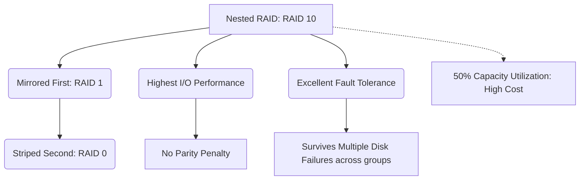

+++
title = "336. RAID 10 / 01"
weight = 336
+++

> **Insight**
> - RAID 10(1+0) 및 RAID 01(0+1)은 RAID 1(미러링)의 뛰어난 데이터 안정성과 RAID 0(스트라이핑)의 막강한 I/O 성능을 결합한 하이브리드(Nested) RAID 아키텍처이다.
> - 패리티(Parity) 연산이 전혀 개입되지 않으므로, 쓰기 페널티(Write Penalty) 없이 최고 수준의 읽기/쓰기 성능과 리빌딩(Rebuild) 속도를 자랑하는 데이터베이스 최고의 스토리지 솔루션이다.
> - 하드웨어 투자 비용(총 용량의 50%만 사용 가능)이 가장 높지만, 미션 크리티컬(Mission Critical) 엔터프라이즈 환경에서는 성능과 무결성을 위해 비용을 기꺼이 지불하고 표준으로 채택한다.

## Ⅰ. RAID 10 및 01의 개요
### 1. 정의
- **RAID 10 (1+0, Stripe of Mirrors):** 최소 4개의 디스크를 요구하며, 디스크들을 먼저 2개씩 짝지어 RAID 1(미러링)로 묶은 뒤, 생성된 미러링 그룹들을 다시 상위에서 RAID 0(스트라이핑)으로 묶는 방식이다.
- **RAID 01 (0+1, Mirror of Stripes):** 반대로 디스크들을 먼저 RAID 0(스트라이핑)으로 묶은 그룹을 두 개 만든 후, 이 두 그룹 간에 RAID 1(미러링)을 적용하는 방식이다.

### 2. 필요성
단일 RAID 레벨의 한계를 극복하기 위해 등장했다. 기업의 핵심 데이터베이스(DBMS) 환경은 극단적인 임의 읽기/쓰기(Random I/O) 성능을 요구함과 동시에 단 1바이트의 데이터 유실도 허용하지 않는다. RAID 5나 RAID 6는 복잡한 패리티 연산에 따른 쓰기 성능 저하가 치명적이고, 단순 RAID 1은 용량 확장이 어렵기 때문에, 두 마리 토끼를 모두 잡는 중첩 아키텍처가 필수적으로 요구되었다.

📢 **섹션 요약 비유:** 뛰어난 달리기 속도(RAID 0)를 가진 척후병과 방어력이 뛰어난(RAID 1) 중장갑병을 하나로 융합시켜, 속도와 방어력을 모두 갖춘 무적의 하이브리드 전사를 탄생시킨 것과 같습니다.

## Ⅱ. 핵심 아키텍처 및 동작 원리
### 1. 동작 메커니즘
동일하게 4개의 디스크를 사용하더라도 묶는 순서에 따라 아키텍처의 강건함이 완전히 달라진다.

**[ RAID 10 (1+0) 아키텍처 ] - 현대의 표준**
```text
Host Data: [ A, B, C, D ]
            +----- RAID 0 (Stripe) -----+
            |                           |
    +-- RAID 1 (Mirror) --+     +-- RAID 1 (Mirror) --+
    |                     |     |                     |
  Disk 0                Disk 1 Disk 2                Disk 3
 [A, C]                [A, C] [B, D]                [B, D]
```

**[ RAID 01 (0+1) 아키텍처 ] - 결함률이 높아 사장됨**
```text
Host Data: [ A, B, C, D ]
            +----- RAID 1 (Mirror) -----+
            |                           |
    +-- RAID 0 (Stripe) --+     +-- RAID 0 (Stripe) --+
    |                     |     |                     |
  Disk 0                Disk 1 Disk 2                Disk 3
 [A, C]                [B, D] [A, C]                [B, D]
```

### 2. 세부 기술 요소
- **데이터 흐름의 차이:** 호스트가 기록 명령을 내리면, RAID 10은 RAID 0 컨트롤러가 데이터를 분할하여 두 하위 RAID 1 셋(Set)으로 보내고, 각 미러 그룹은 내부에서 동시에 데이터를 기록한다.
- **내결함성(Fault Tolerance)의 결정적 차이:** 
  - **RAID 10:** 그룹 A에서 디스크 1개, 그룹 B에서 디스크 1개가 동시에 고장 나도 전체 시스템은 완벽히 정상 작동한다. (최대 50%의 디스크 고장 생존 가능)
  - **RAID 01:** 왼쪽 그룹의 디스크 하나가 고장 나면 왼쪽 스트라이프 전체가 파괴된다. 그 상태에서 오른쪽 그룹의 디스크 중 아무거나 하나 더 죽으면 시스템 전체 데이터가 증발한다. 따라서 실무에서 RAID 01은 절대 권장되지 않는다.

📢 **섹션 요약 비유:** RAID 10은 쌍둥이 형제 두 팀을 모아 팀을 짠 것이라서 각 팀에서 한 명씩 다쳐도 경기가 가능하지만, RAID 01은 2인3각 팀을 둘 만들어서 묶은 것이라 한 명만 넘어져도 팀 전체가 박살 나는 치명적인 차이가 있습니다.

## Ⅲ. 주요 기술적 특징
### 1. 장점
- **최상의 쓰기 성능 (No Write Penalty):** RAID 5/6와 같은 지연을 유발하는 XOR 또는 갈루아 패리티 연산이 전혀 없다. 단순 복사만 일어나므로 컨트롤러 오버헤드 없이 극한의 IOPS(초당 입출력 횟수)를 제공한다.
- **초고속 리빌딩 (Ultra-fast Rebuild):** 디스크가 고장 나서 교체할 경우, 복잡한 연산 없이 미러링 된 짝꿍 디스크에서 1:1로 블록만 복사해 오면 되므로 복구 속도가 매우 빠르고 복구 중 시스템 부하도 거의 없다.

### 2. 한계점 및 해결방안
- **최악의 공간 효율성과 고비용 (Highest Cost / Low Efficiency):** 구매한 전체 디스크 물리 용량의 정확히 50%만 데이터를 저장하는 데 사용할 수 있다. 테라바이트/페타바이트 스케일로 올라갈수록 어마어마한 인프라 예산 낭비를 초래한다.
- **해결방안:** 성능이 최우선이고 무결성이 타협 불가능한 1 Tier 스토리지(OLTP 데이터베이스 트랜잭션 영역)에만 선별적으로 RAID 10을 적용하고, 단순 보관용 데이터나 백업 존(Zone)은 RAID 5나 RAID 6로 분리하는 계층화(Tiering) 스토리지 전략을 사용한다.

📢 **섹션 요약 비유:** F1 레이싱 머신처럼 성능은 세계 최고지만, 연비(공간 효율)가 최악이고 차량 가격(인프라 비용)이 천문학적으로 비싸서, 꼭 필요한 핵심 경기(DB 서버)에만 출전시키는 것과 같습니다.

## Ⅳ. 구현 및 응용 사례
### 1. 산업 적용 분야
- **OLTP 데이터베이스 (Online Transaction Processing):** 초당 수만 건의 결제 승인, 트랜잭션 업데이트(Insert/Update/Delete)가 폭주하는 금융권, 이커머스의 메인 오라클(Oracle), MSSQL, MySQL DB 스토리지는 거의 예외 없이 RAID 10 구성을 표준으로 삼는다.
- **가상화 호스트 (Virtualization Hypervisor):** 수백 대의 가상 머신(VM) 운영체제가 하나의 스토리지에서 동시에 부팅하고 임의 접근을 발생시키는 I/O 블렌더(Blender) 현상을 버텨내기 위한 프라이머리 데이터스토어.

### 2. 실제 활용 시나리오
대규모 온라인 게임 서비스의 인증 및 결제 데이터베이스 서버 구축 시, 1TB짜리 최상급 기업용 SAS SSD 12개를 구매하여 RAID 10으로 구성한다. 12TB 중 6TB의 용량만 사용하게 되지만, 수만 명의 동시 접속자가 발생시키는 예측 불가능한 Random Write 트래픽을 완벽하게 처리해 내며 무중단 서비스를 제공한다.

📢 **섹션 요약 비유:** 쉴 새 없이 몰려드는 은행 본점의 수많은 VIP 고객들을 지연 없이 즉각적으로 응대하기 위해, 창구 직원을 두 배로 늘려(비용 상승) 대기 시간을 0으로 만드는 프라이빗 뱅킹 서비스와 같습니다.

## Ⅴ. 발전 동향 및 미래 전망
### 1. 최신 트렌드
- **올플래시 스토리지(All-Flash Array)와의 결합:** SSD 기술이 엔터프라이즈의 대세가 되면서, 극한의 IOPS를 뽑아내기 위해 초고속 NVMe SSD들을 RAID 10 아키텍처로 엮어 기존과는 차원이 다른 밀리초 단위 이하의 스토리지 지연시간(Ultra-low Latency)을 구현하고 있다.
- **RAID 01의 완전한 소멸:** 내결함성 관점의 구조적 결함이 치명적이라는 사실이 업계에 각인되면서, 현재 출시되는 스토리지 컨트롤러나 OS 관리 툴에서는 RAID 01 옵션 자체를 아예 제거하고 RAID 10만을 지원하는 추세이다.

### 2. 차세대 기술 연계
스토리지 가상화 트렌드와 맞물려, 최근의 소프트웨어 정의 스토리지(vSAN, Ceph 등) 시스템에서는 물리적인 RAID 카드 대신 네트워크로 연결된 노드 단위로 데이터의 '복제(Replica = RAID 1)' 와 '스트라이핑(RAID 0)' 정책을 클러스터 레벨에서 구현하는 분산 분할 구조(Distributed RAID 10)로 그 철학이 계승되고 있다.

📢 **섹션 요약 비유:** 하드웨어에 종속된 비싼 기계를 사는 대신, 이제는 소프트웨어 마법(SDS)을 통해 인터넷으로 연결된 수십 대의 컴퓨터 자원을 하나의 거대한 RAID 10 슈퍼컴퓨터처럼 묶어 쓰는 클라우드 시대로 진화했습니다.

---

### 💡 Knowledge Graph & Child Analogy

- **Child Analogy**: 내 중요한 레고 성(데이터)을 아주 튼튼하면서도 가장 빨리 옮기는 방법이야. 쌍둥이 친구 두 명을 부르고(미러링), 또 다른 쌍둥이 친구 두 명을 불러서(미러링), 짐을 절반씩 나누어 들고 뛰게(스트라이핑) 하는 거지. 짐 나르는 친구가 엄청 많이 필요해서 간식비(비용)는 많이 들지만, 속도도 가장 빠르고 중간에 누가 넘어져도 똑같은 짐을 든 쌍둥이가 바로 옆에 있어서 가장 안심이 돼!
