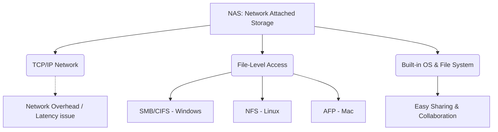

+++
title = "338. NAS (Network Attached Storage)"
weight = 338
+++

> **Insight**
> - NAS(Network Attached Storage)는 TCP/IP 기반의 이더넷(Ethernet) 네트워크를 통해 여러 클라이언트가 파일 수준(File-Level)에서 데이터에 접근할 수 있도록 설계된 전용 파일 서버 스토리지이다.
> - 자체적인 운영체제(OS)와 파일 시스템을 내장하고 있어 호스트 서버의 종속 없이 독립적으로 동작하며, 파일 공유 및 협업 환경에 최적화된 높은 편의성을 제공한다.
> - 이기종 OS 환경(Windows, Linux, macOS) 간의 원활한 데이터 통합 공유가 가능하지만, 범용 네트워크의 대역폭 한계와 프로토콜 오버헤드로 인해 블록 스토리지(SAN) 대비 고성능 I/O 환경에는 부적합하다.

## Ⅰ. NAS의 개요
### 1. 정의
NAS(Network Attached Storage)는 내부 스토리지 베이(HDD/SSD)를 갖추고 네트워크(LAN) 인터페이스를 통해 연결되는 독립적인 저장장치 시스템이다. 일반 서버에서 불필요한 기능(그래픽 처리, 복잡한 애플리케이션 등)을 제거하고 오직 '파일 서빙(File Serving)'에만 최적화된 경량화 운영체제(Micro OS)를 탑재한 장비이다.

### 2. 필요성
기업이나 조직 내에서 수많은 사용자 및 다양한 운영체제(Windows, Mac, Linux) 사용자가 특정 파일을 쉽게 공유하고 동기화할 수 있는 중앙 집중형 데이터 저장소가 필요해졌다. 과거에는 일반 PC나 서버에 공유 폴더를 설정하여 사용했으나, 관리의 복잡성, 보안 취약성, 전력 소모의 비효율성을 해결하기 위해 스토리지 전용 어플라이언스(Appliance)인 NAS가 탄생했다.

📢 **섹션 요약 비유:** 회사의 각 부서 직원들이 개인 책상(로컬 디스크)에 문서를 두지 않고, 누구나 사원증(네트워크 접근)만 있으면 언제든 꺼내볼 수 있도록 복도 한가운데에 설치한 거대한 '공용 디지털 캐비닛'과 같습니다.

## Ⅱ. 핵심 아키텍처 및 동작 원리
### 1. 동작 메커니즘
NAS 장비 내부는 물리적 디스크가 RAID로 구성되고 자체 파일 시스템(예: EXT4, Btrfs, ZFS)으로 포맷되어 있다. 클라이언트 PC는 네트워크를 통해 표준 파일 공유 프로토콜을 사용하여 NAS에 접근하고 파일의 읽기/쓰기를 요청한다.

```text
[ Windows PC ] (SMB/CIFS) -\
                           +---> [ LAN Switch/Router ] ---> [ NAS System ]
[ Linux Server ] (NFS) ----/                                + (CPU + RAM + OS)
                           +---> [ LAN Switch/Router ] ---> + File System (Btrfs/EXT4)
[ macOS Client ] (AFP/SMB)-/                                + RAID Controller & Drives
```

### 2. 세부 기술 요소
- **파일 공유 프로토콜 지원:** 
  - **SMB/CIFS (Server Message Block):** 주로 Windows 환경에서 네트워크 드라이브(예: `Z:\`)로 맵핑하여 사용하는 표준 프로토콜.
  - **NFS (Network File System):** UNIX/Linux 서버 시스템 환경에서 고속 파일 마운트를 위해 사용하는 프로토콜.
  - **AFP (Apple Filing Protocol):** Mac 생태계를 위한 프로토콜 (최근에는 Mac도 SMB를 주로 사용).
- **파일 레벨(File-Level) 액세스:** 데이터 요청이 '블록' 단위(예: "디스크의 104번지부터 120번지까지 가져와")가 아니라 '파일' 단위(예: "재무제표_2024.xlsx 파일을 열어줘")로 이루어지므로, 파일 시스템의 메타데이터 관리를 NAS 장비 자체가 전담한다.

📢 **섹션 요약 비유:** 식당에서 주방장(스토리지)에게 직접 재료 썰어달라(블록 레벨)고 하지 않고, 홀 직원(프로토콜)에게 "김치찌개(파일) 하나 주세요"라고 메뉴 이름으로 주문하면 완성된 요리가 나오는 편안한 시스템입니다.

## Ⅲ. 주요 기술적 특징
### 1. 장점
- **뛰어난 공유 및 협업 (Easy File Sharing):** 다양한 OS가 혼재된 네트워크 환경에서 클라이언트 제약 없이 폴더 하나에 동시 접근하여 작업할 수 있어 협업 생산성이 극대화된다.
- **배포 및 관리의 용이성 (Plug and Play):** LAN 케이블을 꽂고 IP 주소만 할당하면 즉시 웹 기반 관리자 페이지(Web GUI)를 통해 사용자 계정 할당, 권한 부여, 볼륨 생성을 누구나 쉽게 할 수 있어 IT 전담 인력이 부족한 중소기업에 매우 적합하다.

### 2. 한계점 및 해결방안
- **네트워크 병목 및 성능 한계 (Network Overhead):** TCP/IP 네트워크 스택을 거치고 파일 프로토콜(SMB/NFS)의 헤더가 붙는 과정에서 상당한 오버헤드가 발생한다. 트래픽이 몰리면 이더넷 대역폭(예: 1Gbps=125MB/s)이 병목이 되어 고성능 데이터베이스용 스토리지로는 부적합하다.
- **해결방안:** 네트워크 대역폭 한계를 극복하기 위해 다중 랜카드 포트를 묶는 링크 어그리게이션(Link Aggregation / LACP), 혹은 10GbE, 40GbE 등 고속 이더넷 인터페이스를 장착하여 병목을 최소화한다.

📢 **섹션 요약 비유:** 수십 명이 동시에 공용 캐비닛(NAS)에 몰려들어 문서를 꺼내려 하면 복도(네트워크)가 꽉 막히고 서류철 넘기는 속도가 느려지므로, 복도를 더 넓게 공사(10GbE 업그레이드)해야 하는 단점이 있습니다.

## Ⅳ. 구현 및 응용 사례
### 1. 산업 적용 분야
- **중소규모 비즈니스 (SMB) 파일 서버:** 부서 내 문서 공유, 영상/사진 등 대용량 멀티미디어 자산의 중앙 집중 저장소(Media Archive), 기업 내부 프라이빗 클라우드(Private Cloud).
- **개인 및 홈 미디어 센터:** 가정에서 스마트폰, 스마트 TV, 태블릿 등을 통해 영화를 스트리밍(Plex Media Server)하거나 개인 스마트폰 사진을 자동 백업하는 용도 (예: Synology, QNAP 등의 소비자형 모델).

### 2. 실제 활용 시나리오
한 영상 프로덕션 회사에서 편집팀 5명(Mac 사용자)과 CG팀 5명(Windows 사용자)이 거대한 4K 원본 영상 파일을 각각의 PC에 복사하지 않고, 10GbE 네트워크에 연결된 8베이 고성능 NAS에 올려둔 채 다이렉트로 프리미어 프로(Premiere Pro) 프로젝트를 열어 실시간으로 공동 컷 편집 워크플로우를 진행한다.

📢 **섹션 요약 비유:** 집집마다 우물을 파서 물을 마시는(개별 USB 저장) 대신, 동네 한가운데에 크고 깨끗한 상수도 저수지(NAS)를 만들고 수도관(LAN)을 연결해 온 동네 사람들이 수도꼭지만 틀면 깨끗한 물(데이터)을 펑펑 쓰는 모습입니다.

## Ⅴ. 발전 동향 및 미래 전망
### 1. 최신 트렌드
- **앱 생태계 확장 (Smart Storage):** 단순한 저장 공간을 넘어, NAS 운영체제 안에 도커(Docker) 컨테이너 구동, 자체 메일 서버, 웹 호스팅, 가상 머신(VM) 호스팅까지 가능한 일종의 '미니 애플리케이션 서버'로 진화하며 컴퓨팅과 스토리지가 융합되고 있다.
- **SSD 캐싱(Caching) 및 NVMe 도입:** 하드디스크의 느린 랜덤 읽기 성능을 보완하기 위해 NAS 내부에 고속 NVMe M.2 SSD를 티어링(Tiering) 캐시 전용으로 꽂아 자주 찾는 파일의 접근 속도를 SAN(블록 스토리지)에 준하는 수준으로 끌어올리고 있다.

### 2. 차세대 기술 연계
하이브리드 클라우드(Hybrid Cloud) 아키텍처와 결합하여, NAS 시스템이 로컬에 저장된 자주 쓰는 데이터를 서비스하면서 뒷단에서는 오래된 데이터를 퍼블릭 클라우드(AWS S3, Google Cloud)로 자동 아카이빙(Cloud Sync)하는 게이트웨이(Cloud Storage Gateway) 역할을 수행하며 진화하고 있다.

📢 **섹션 요약 비유:** 예전의 캐비닛이 단순한 깡통이었다면, 미래의 캐비닛은 안에 로봇 비서(가상화/앱)가 들어있어서 스마트폰 사진도 알아서 정리해주고 남는 서류는 구글 클라우드 창고에 알아서 보내놓는 인공지능 수납장으로 진화했습니다.

---

### 💡 Knowledge Graph & Child Analogy

- **Child Analogy**: 집 안에 흩어져 있는 장난감들을 거실 한가운데 있는 크고 똑똑한 장난감 상자(NAS)에 다 모아놓는 거야. 그러면 아빠 방 컴퓨터에서도, 엄마 스마트폰에서도, 내 태블릿에서도 와이파이(네트워크)만 켜면 언제든지 상자 안에 있는 장난감(파일)을 함께 가지고 놀 수 있어서 아주 편리해!
