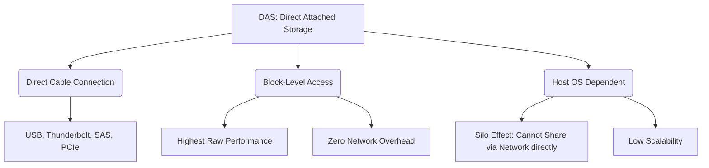

+++
title = "339. DAS (Direct Attached Storage)"
weight = 339
+++

> **Insight**
> - DAS(Direct Attached Storage)는 네트워크를 거치지 않고 서버나 클라이언트 시스템의 전용 인터페이스(USB, SATA, SAS 등)에 1:1로 직접 연결되는 가장 전통적이고 원초적인 스토리지 아키텍처이다.
> - 서버와 스토리지 사이에 전용 고속 케이블만 존재하므로, 네트워크 오버헤드가 전혀 없는 순수한 원시 I/O 성능(Raw Performance)과 최저 지연 시간(Ultra-low Latency)을 제공한다.
> - 확장성(Scalability)과 다른 서버와의 스토리지 공유(Sharing)가 불가능하다는 구조적 한계로 인해, 현대 엔터프라이즈 통합 인프라보다는 개별 서버의 독립적인 고속 처리 영역에 국한되어 사용된다.

## Ⅰ. DAS의 개요
### 1. 정의
DAS(Direct Attached Storage)는 스토리지 디바이스(내장형 하드디스크, 외장형 RAID 인클로저 등)를 네트워크 인프라나 스위치를 통하지 않고, 호스트 컴퓨터(서버 또는 PC)의 메인보드 인터페이스 호스트 버스 어댑터(HBA) 포트에 직접 케이블로 직결하는 스토리지 시스템이다. 

### 2. 필요성
데이터 저장소가 외부에 분리되기 전인 PC의 태동기부터 가장 자연스럽게 사용된 방식이다. 네트워크 스토리지(NAS/SAN)가 도입된 이후에도 1대의 서버가 극단적인 처리 속도로 전용 스토리지 리소스를 독점해야 하는 데이터베이스 환경, 혹은 가장 경제적으로 대용량 외장 스토리지를 확보해야 하는 환경에서 여전히 강력한 필요성을 가진다.

📢 **섹션 요약 비유:** 도서관(네트워크 스토리지)에 걸어가서 책을 빌려오는 대신, 내 개인 책상 바로 옆에 전용 책장(DAS)을 딱 붙여 놓고 팔만 뻗어서 빛의 속도로 책을 꺼내보는 가장 원초적인 구조입니다.

## Ⅱ. 핵심 아키텍처 및 동작 원리
### 1. 동작 메커니즘
서버의 운영체제(OS)가 메인보드에 장착된 HBA(Host Bus Adapter) 카드를 통해 스토리지 장치를 제어한다. 스토리지는 스스로 파일 시스템이나 OS를 가지지 않은 단순한 디스크 배열(JBOD, Just a Bunch Of Disks) 깡통이거나 하드웨어 RAID 박스이며, 파일 관리 및 시스템 포맷은 연결된 호스트 서버의 OS가 독점적으로 전담하여 블록 레벨(Block-Level) I/O 통신을 한다.

```text
+-------------------+                    +-----------------------+
|  Host Server (OS) |                    |  DAS Storage Box      |
|                   |  <-- SAS Cable --> |                       |
| File System (NTFS)|  <-- USB 3.x ----> |  [ HDD / SSD Array ]  |
| HBA/RAID Card     |  <-- PCIe / NVMe-> |                       |
+-------------------+                    +-----------------------+
(통신 경로: CPU -> PCIe Bus -> HBA -> Cable -> DAS 디스크 컨트롤러)
```

### 2. 세부 기술 요소
- **직접 연결 인터페이스:** 
  - **내부 연결:** 메인보드 내부의 SATA, NVMe M.2 슬롯, PCIe 확장 카드
  - **외부 연결:** 외장 스토리지를 연결하기 위한 SAS (Serial Attached SCSI), USB-C, Thunderbolt 3/4 등 초고속 전용 규격 사용.
- **블록 레벨 데이터 전송:** 네트워크 프로토콜 캡슐화(TCP/IP, iSCSI 등) 과정이 생략되므로 SCSI 또는 NVMe 명령어가 호스트에서 디스크로 거의 다이렉트로 꽂혀 CPU 사이클 소모와 I/O 지연을 극한으로 줄인다.

📢 **섹션 요약 비유:** 사장님(호스트 서버)과 비서(스토리지) 사이에 통신망이나 결재 라인(네트워크 프로토콜) 없이, 사무실 문 하나만 열면 비서가 대기하고 있어 다이렉트로 서류를 주고받는 숨막히는 초고속 업무 환경과 같습니다.

## Ⅲ. 주요 기술적 특징
### 1. 장점
- **최고의 성능 대비 비용 (Best Cost/Performance):** 스위치나 고가의 네트워크 장비, 전용 스토리지 운영체제 라이선스가 필요 없으므로 초기 구축 비용이 매우 저렴하다. 그럼에도 불구하고 물리적 케이블 대역폭(예: Thunderbolt 4의 40Gbps)을 온전히 혼자 사용하므로 성능은 가장 강력하다.
- **간단한 구조와 설정 (Simplicity):** 복잡한 네트워크 라우팅, IP 서브넷, LUN(Logical Unit Number) 매핑 등의 설정 없이 그냥 케이블을 꽂고 서버에서 포맷하면 즉시 단일 드라이브처럼 인식된다.

### 2. 한계점 및 해결방안
- **고립된 리소스(Silo) 및 비효율성 (Resource Isolation):** 특정 서버에만 종속되므로(Dedicated), A 서버의 DAS 스토리지 공간이 90% 비어있어도 용량이 부족한 B 서버가 네트워크를 통해 이 공간을 빌려 쓸 수 없다. 기업 전체의 스토리지 리소스 파편화(Fragmentation)를 유발한다.
- **가용성 한계 (SPOF):** 스토리지가 연결된 호스트 서버 자체가 다운되면 스토리지 안의 데이터는 멀쩡하더라도 다른 서버에서 접근할 수 없어 서비스가 완전히 정지된다.
- **해결방안:** 이 고질적인 한계를 극복하기 위해 엔터프라이즈 환경에서는 스토리지를 서버 뒷단에 통합하여 여러 서버가 공유할 수 있도록 분리해내는 SAN(Storage Area Network) 아키텍처로 진화하게 되었다.

📢 **섹션 요약 비유:** 전용 책장이 텅텅 비어 있어도 옆 자리 직원이 빌려 쓸 수가 없어서 사무실 전체 공간 효율이 엉망이 되고, 책장 주인이 결근(서버 다운)하면 책장 자물쇠를 열 사람이 없어 책을 전혀 볼 수 없는 구조적 단점이 있습니다.

## Ⅳ. 구현 및 응용 사례
### 1. 산업 적용 분야
- **초고성능 단일 노드 DB 서버:** 응답 시간(Latency)이 0.1밀리초 수준이어야 하는 초고빈도 주식 거래 시스템(HFT)의 로컬 DB 캐시 데이터 영역.
- **미디어 크리에이터 워크스테이션:** 8K 해상도 이상의 무거운 영상 소스를 실시간으로 스크러빙(Scrubbing)해야 하는 전문 영상 편집자 데스크탑의 Thunderbolt 외장 RAID 스토리지 랙.

### 2. 실제 활용 시나리오
한 영상 프로덕션의 메인 컬러리스트(Colorist)는 100TB 규모의 대용량 영상 프로젝트를 작업하기 위해, 자신의 Mac Studio에 썬더볼트(Thunderbolt) 케이블로 8베이 DAS 랙을 다이렉트로 연결하여 사용한다. 네트워크로 연결된 NAS 속도(100MB/s)로는 작업이 불가능하지만, DAS(2000MB/s)를 통해 끊김 없이 방대한 원본 데이터를 로컬 드라이브처럼 실시간 편집한다.

📢 **섹션 요약 비유:** 여러 사람이 나눠 쓰는 공용 작업실(네트워크 환경)에서는 집중하기 힘든 천재 아티스트(영상 작업자)가 자신만의 방음 스튜디오(DAS)에 틀어박혀 혼자만의 최고 속도로 작업에 몰두하는 세팅입니다.

## Ⅴ. 발전 동향 및 미래 전망
### 1. 최신 트렌드
- **NVMe 기반 초고속 DAS의 대중화:** 과거 거대한 랙 형태였던 DAS 장비가 M.2 NVMe SSD와 USB4 / Thunderbolt 인터페이스의 발전으로 인해, 명함 크기만 한 외장 장치가 3,000MB/s 이상의 읽기/쓰기 속도를 내며 전문가 시장의 이동형 로컬 스토리지 한계를 파괴하고 있다.
- **가상화 환경 내 vSAN 구조의 기반 (SDS 회귀):** 거대한 중앙 집중형 SAN 스토리지 대신, 각각의 가상화 호스트 서버들이 로컬로 꽂고 있는 DAS(주로 NVMe/SAS SSD 배열) 자원들을 소프트웨어(vSAN, Nutanix 등)로 묶어 거대한 가상 공유 스토리지 플를 형성하는 HCI(Hyper-Converged Infrastructure) 트렌드의 가장 핵심적인 물리적 하부 구조로 DAS가 화려하게 부활하고 있다.

### 2. 차세대 기술 연계
PCIe 5.0과 CXL(Compute Express Link) 기술의 등장으로, 서버 메인보드에 직접 꽂히는 DAS 개념이 디스크 스토리지를 넘어 메모리 모듈 영역까지 다이렉트로 확장되어 거대 AI 모델의 파라미터 캐싱 공간으로 융합되는 아키텍처로 진화 중이다.

📢 **섹션 요약 비유:** 옛날에 유행 지나 창고에 처박아 두었던 내 전용 책장(DAS)이, 최근 클라우드와 소프트웨어 가상화라는 마법을 만나 다른 친구들의 책장과 투명 터널로 연결(HCI)되면서 다시 가장 사랑받는 첨단 가구로 재평가받고 있는 상황입니다.

---

### 💡 Knowledge Graph & Child Analogy

- **Child Analogy**: 컴퓨터 책상 옆에 바로 USB 선을 꽂아서 나 혼자만 쓸 수 있는 외장 하드디스크가 DAS야. 와이파이를 타고 뱅글뱅글 돌아갈 필요 없이 나랑 전선으로 직빵 연결되어 있어서 세상에서 가장 빠르게 게임 파일을 복사할 수 있지만, 옆 방에 있는 내 동생이 그 게임 파일을 맘대로 빌려 갈 수는 없다는 단점이 있지!
