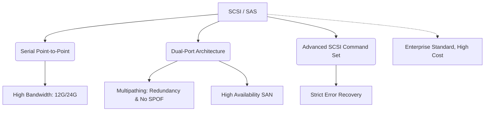

+++
title = "340. SCSI 및 SAS (Serial Attached SCSI)"
weight = 340
+++

> **Insight**
> - SCSI(Small Computer System Interface)와 그 진화형인 SAS(Serial Attached SCSI)는 엔터프라이즈 환경에서 데이터의 무결성 보장과 극한의 연속 동작 신뢰성을 위해 설계된 최고급 디스크 인터페이스 표준이다.
> - 병렬(Parallel) 통신 방식이었던 과거 SCSI의 물리적 한계를 직렬(Serial) 통신 방식으로 돌파한 것이 SAS이며, 다중 연결(Multipathing)과 이중 포트(Dual-port) 아키텍처를 통해 단일 장애점(SPOF)을 제거한다.
> - SATA가 데스크탑 시장을 점령했다면, SAS는 무중단 운영이 필수적인 서버 스토리지 및 데이터 센터의 디스크 연결 표준(Backbone)으로 군림해 왔으며, 최근 NVMe 전환기에도 여전히 레거시와 대용량 아카이브 영역에서 막대한 비중을 차지하고 있다.

## Ⅰ. SCSI 및 SAS의 개요
### 1. 정의
- **SCSI (스카시):** 1980년대 컴퓨터와 주변기기(하드디스크, 테이프 드라이브 등)를 데이지 체인(Daisy Chain) 방식으로 연결하여 고속 데이터를 주고받기 위해 만들어진 범용 병렬(Parallel) 인터페이스 명령 세트 및 물리 규격이다.
- **SAS (Serial Attached SCSI):** 무겁고 한계에 부딪힌 기존 병렬 SCSI 케이블 방식을 버리고, 더 얇은 케이블을 통한 고속 점대점(Point-to-Point) 직렬 통신 방식을 도입하면서도 기존 SCSI의 강력하고 정교한 명령어 체계(Protocol)는 그대로 계승한 차세대 기업용 인터페이스이다.

### 2. 필요성
기업용 데이터베이스나 대규모 서버 스토리지(SAN/NAS)는 데스크탑 PC와는 차원이 다른 요구사항을 가진다. 수십 개의 하드디스크가 24시간 365일 내내 쉬지 않고 무거운 I/O 트래픽을 처리해야 하며, 케이블 하나가 끊어지거나 디스크 컨트롤러 하나가 고장 나도 시스템이 멈추어서는 안 된다. 일반 SATA 규격은 이러한 결함 허용(Fault Tolerance)과 복잡한 에러 복구 기능을 제공하지 못하므로, 완벽한 신뢰성과 이중화 설계가 가능한 SAS 인터페이스가 절대적으로 필요하다.

📢 **섹션 요약 비유:** 일반 데스크탑(SATA)이 평범한 출퇴근용 승용차라면, 서버 스토리지(SAS)는 엔진과 조향 장치가 이중 삼중으로 설계되어 1년 내내 사막을 가로질러 짐을 날라도 퍼지지 않는 무적의 특수 군용 트럭 규격과 같습니다.

## Ⅱ. 핵심 아키텍처 및 동작 원리
### 1. 동작 메커니즘
SAS 아키텍처는 단순히 디스크와 메인보드를 1:1로 잇는 것을 넘어, 중간에 거대한 스위칭 계층(SAS Expander)을 두어 하나의 호스트 컨트롤러(HBA)가 수천 개의 디스크 드라이브를 거미줄처럼 제어할 수 있는 구조를 가진다.

```text
+-------------------+       +-----------------+       +----------------+
| Host Server (HBA) | ----> |  SAS Expander   | ----> | SAS Disk Drive | (Port A)
| (Dual Controller) |       | (Switch Matrix) |       |                |
+-------------------+       +-----------------+       +----------------+
          \                                                  / (Port B - Active/Active 통신)
           \-----------------(Redundant Path)---------------/
```

### 2. 세부 기술 요소
- **이중 포트 (Dual-porting):** SAS 디스크 드라이브 뒷면에는 데이터가 오가는 통로(포트)가 2개(Port A, Port B) 존재한다. 각 포트를 서로 다른 RAID 컨트롤러에 연결하여 멀티패싱(Multipathing)을 구성하면, 한쪽 경로가 죽어도 다른 쪽 경로를 통해 0.1초의 끊김 없이 데이터를 무중단으로 읽고 쓸 수 있다. (SATA는 포트가 1개뿐임)
- **SCSI 명령어 세트 (Command Set):** 단순 읽기/쓰기 외에 강력한 에러 복구 제어, 다중 명령어 대기열(TCQ), 상태 진단 및 진보된 섹터 오류 탐지 등 엔터프라이즈 환경에서 데이터 손상을 막기 위한 수많은 고급 제어 명령어를 내장하고 있다.
- **SAS Expander:** 네트워크 스위치(Switch)와 유사한 역할을 하여, HBA 포트 수를 논리적으로 확장시켜 하나의 서버가 최대 65,535개의 SAS 장치와 통신할 수 있게 해주는 핵심 토폴로지 장비이다.

📢 **섹션 요약 비유:** SAS 디스크는 출입구가 두 개(이중 포트) 있어서 정문에 불이 나도 후문으로 즉각 대피(무중단 운영)할 수 있으며, 중간에 통신 교환수(Expander)가 있어서 사장님 한 명이 수만 명의 직원과 연락망을 구축할 수 있는 완벽한 빌딩 구조입니다.

## Ⅲ. 주요 기술적 특징
### 1. 장점
- **극강의 신뢰성과 무결성 (High Reliability):** 케이블의 전압 신호 레벨 자체가 SATA보다 높아 데이터 전송 중 발생하는 노이즈(오류)에 강하다. 디스크 자체의 물리적 내구성(MTBF, 10K/15K RPM) 조차 기업용 기준에 맞춰져 있어 가장 혹독한 환경을 견딘다.
- **전이중 통신 (Full-Duplex):** SAS는 데이터를 보내는 동시에(TX) 다른 데이터를 받을 수 있는(RX) 양방향 동시 통신이 가능하여 트래픽 정체를 없애고 실효 성능을 크게 끌어올린다. (SATA는 한 번에 보내거나 받거나 한쪽만 가능한 반이중(Half-Duplex) 방식임).

### 2. 한계점 및 해결방안
- **막대한 비용 (Extremely High Cost):** 구조적 복잡성, 이중 포트 설계, 고성능 컨트롤러 칩셋으로 인해 SAS 드라이브 및 관련 HBA 컨트롤러 가격은 동급 용량의 SATA 대비 몇 배에서 수십 배 비싸다.
- **NVMe 전환의 위협:** 수십 년간 엔터프라이즈 제왕 자리를 지켰으나, 물리적으로 회전하는 플래터(HDD)의 한계와 PCIe 버스에 직결되는 NVMe의 압도적인 속도(수천 MB/s)를 12Gbps 또는 24Gbps의 SAS 인터페이스가 따라가지 못해 최상위 퍼포먼스 티어(Tier)에서 밀려나고 있다.
- **해결방안:** 성능이 최우선인 핫 데이터 영역은 NVMe SSD로 넘겨주고, SAS는 압도적인 확장성과 안전성을 바탕으로 거대한 파일 서버의 고용량 백엔드 아카이브 디스크(NL-SAS)를 묶는 데 집중하며 역할을 분담하고 있다.

📢 **섹션 요약 비유:** 가장 튼튼하고 안전하지만 차 한 대 값이 엄청나게 비싸며, 최근에는 우주선(NVMe) 같은 새로운 운송수단이 등장하면서 가장 빠른 자리에서는 내려오고 튼튼한 장거리 짐마차 역할을 주로 맡고 있습니다.

## Ⅳ. 구현 및 응용 사례
### 1. 산업 적용 분야
- **엔터프라이즈 SAN 스토리지 (Storage Area Network):** EMC, NetApp, Hitachi 등 글로벌 스토리지 벤더들이 공급하는 대형 컨트롤러 박스 뒷면에 꽂히는 수백 개의 하드디스크 드라이브 모듈 베이스라인 규격.
- **고가용성 클러스터 서버 (HA Cluster):** 서버 2대(Active-Standby)가 1대의 공유 스토리지 박스를 공유할 때, SAS의 다중 포트 기능을 이용해 물리적인 Y자 케이블링으로 Split-Brain 현상을 방지하는 클러스터링 기반 아키텍처.

### 2. 실제 활용 시나리오
금융권 주 센터 데이터베이스 서버 뒷단에는 수십 개의 랙(Rack)으로 이루어진 스토리지가 존재한다. 서버와 디스크 사이를 SAS Expander 섀시를 통해 그물망(Mesh)처럼 연결해 둔다. 새벽에 랙을 연결하는 메인 케이블이 쥐가 갉아먹어 끊어지거나 스위치 보드가 타버려도, OS는 이미 연결된 두 번째 SAS 백업 경로로 데이터를 우회시켜 초당 수천 건의 계좌 이체 트랜잭션을 아무 일 없었다는 듯 정상적으로 처리한다.

📢 **섹션 요약 비유:** 심장(서버)에서 피를 뿜어낼 때, 주요 동맥(SAS 케이블)이 막히면 곧바로 옆의 예비 동맥으로 피가 우회하여 돌도록 설계된 완벽한 생명 유지 장치와 같습니다.

## Ⅴ. 발전 동향 및 미래 전망
### 1. 최신 트렌드
- **SAS 4 (24G SAS)의 등장:** 대역폭 한계를 넘기 위해 대역폭을 두 배로 늘린 24Gbps 규격이 실무에 도입되고 있으며, 플래시 스토리지 전용 SAS SSD들이 이 대역폭을 꽉 채워 사용하고 있다.
- **SATA와의 호환성 (SATA Tunneling over SAS):** SAS 컨트롤러 백플레이트에는 SAS 드라이브뿐만 아니라 저렴한 일반 데스크탑용 SATA 드라이브도 꽂아서 사용할 수 있다. (단, 반대로 SATA 메인보드에 SAS 드라이브를 꽂을 수는 없다). 이를 활용하여 엔터프라이즈 스토리지 내에서 고속 티어는 SAS, 저속 티어는 고용량 SATA를 섞어 쓰는 하이브리드 구성이 보편화되었다.

### 2. 차세대 기술 연계
최상위 성능 시장은 이미 U.2 / U.3 규격 기반의 엔터프라이즈 NVMe SSD 인터페이스로 권력이 이양되었다. NVMe 기술 자체가 과거 SCSI가 고안해 낸 명령어 대기열 철학과 다중 경로(Multipathing) 개념을 완전히 흡수하여 계승하였으므로, SAS는 영광스러운 레거시(Legacy) 기술로서 향후 대용량 아카이브용 기계식 HDD(Nearline SAS) 연결망 표준으로 장수하며 서서히 페이드아웃 될 전망이다.

📢 **섹션 요약 비유:** SAS는 한 시대를 풍미한 위대한 군사 통신망이었습니다. 이제 최전방 전선(NVMe)에는 광통신망이 새로 깔리고 있지만, 후방 부대(아카이브 디스크)의 튼튼한 무전망 통신 표준으로는 여전히 SAS가 듬직하게 자리를 지키고 있는 형국입니다.

---

### 💡 Knowledge Graph & Child Analogy

- **Child Analogy**: 일반 하드디스크(SATA)가 좁은 시골길을 달리는 오토바이라면, 기업용 디스크(SAS)는 넓은 왕복 8차선 고속도로를 달리는 장갑차야. 오토바이는 돌부리에 걸리면 멈춰 서야 하지만, 장갑차는 바퀴(포트)도 두 배로 달려있고 통신 장비도 좋아서 어떤 고장이나 방해물이 나타나도 멈추지 않고 목적지까지 가장 안전하게 데이터 택배를 배달해주는 아주 비싸고 튼튼한 장비란다.
