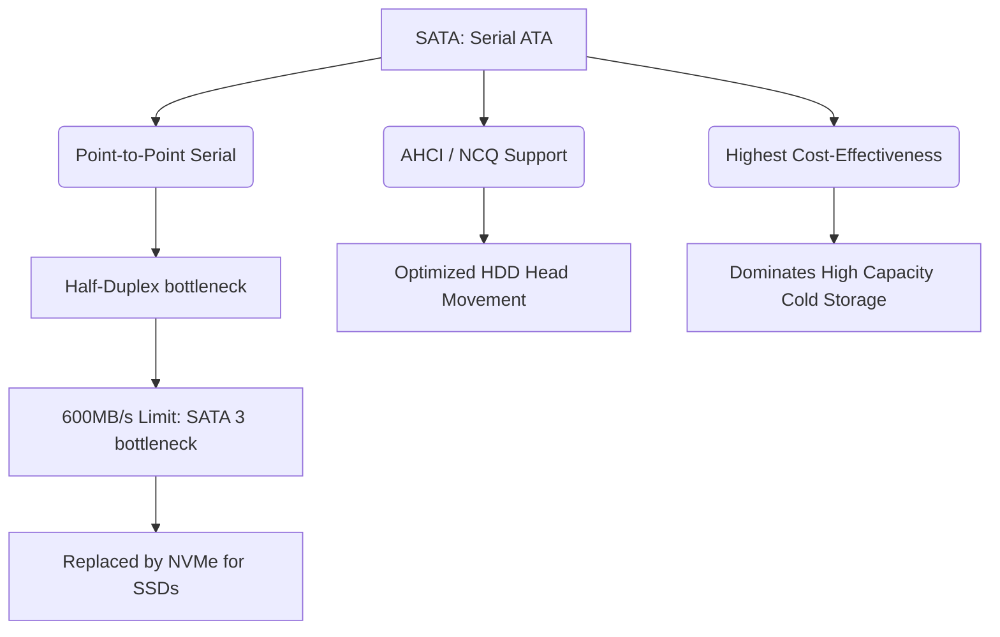

+++
title = "341. SATA (Serial ATA)"
weight = 341
+++

> **Insight**
> - SATA(Serial Advanced Technology Attachment)는 데스크탑 PC와 노트북의 내부 스토리지 인터페이스 시장을 완전히 평정하고 대중화시킨 직렬 통신 기반의 대국민 저장장치 연결 표준이다.
> - 크고 넓적한 병렬형 PATA(IDE) 리본 케이블의 한계를 얇고 간편한 직렬(Serial) 케이블로 혁신하여, 시스템 내부의 공기 흐름 개선과 조립 편의성, 통신 대역폭 확장을 동시에 이뤄냈다.
> - 가격 대비 훌륭한 성능을 제공하지만 반이중(Half-Duplex) 통신과 단일 큐(Queue) 구조의 한계로 인해, 초고속 플래시 스토리지(SSD)의 잠재력을 병목 시키는 레거시 인터페이스가 되어 현재는 NVMe에게 메인보드의 주도권을 넘겨주는 중이다.

## Ⅰ. SATA의 개요
### 1. 정의
SATA(Serial ATA)는 컴퓨터 메인보드의 호스트 버스 어댑터(Host Bus Adapter)와 대용량 저장장치(하드 디스크, ODD, 초기형 SSD) 간의 데이터 전송을 위해 설계된 직렬 기반 물리적/논리적 연결 인터페이스 표준이다. AHCI(Advanced Host Controller Interface)라는 컨트롤러 규격을 주로 사용하여 디스크와 통신한다.

### 2. 필요성
2000년대 초반까지 사용되던 병렬 방식의 PATA(IDE) 케이블은 너무 넓고 굵어 컴퓨터 케이스 내부의 발열 제어를 방해했고, 핀 수가 40/80개에 달해 핀이 휘는 고장이 잦았다. 또한 병렬 신호 간의 간섭(Crosstalk) 문제로 초당 133MB/s 이상의 전송 속도를 내는 것이 불가능했다. 이러한 물리적 제약을 극복하고 고용량 멀티미디어 시대를 맞이하기 위해 더 얇고, 길게 뻗으면서도 월등히 빠른 직렬 통신 인터페이스인 SATA가 필요하게 되었다.

📢 **섹션 요약 비유:** 40명이 어깨동무를 하고 좁은 터널을 동시에 빠져나가려다(병렬 PATA) 엉켜서 넘어지던 것을, 한 명씩 일렬로 세워 KTX 기차에 태워 초고속으로 차례차례 보내는 방식(직렬 SATA)으로 혁신한 것입니다.

## Ⅱ. 핵심 아키텍처 및 동작 원리
### 1. 동작 메커니즘
SATA는 단 7개의 핀(Pin) 구조로 이루어진 얇은 케이블을 사용하여 점대점(Point-to-Point) 방식으로 메인보드와 디스크를 1:1로 직접 연결한다. 이 7개의 핀 중 핵심 통신선은 단 4가닥으로, 두 가닥은 전송(TX), 두 가닥은 수신(RX)을 담당하는 차동 신호(Differential Signaling) 방식을 사용하여 외부 노이즈를 상쇄시킨다.

```text
[ Motherboard ]                          [ SATA Drive (HDD/SSD) ]
  SATA Port  ============== (SATA Data Cable / 7 Pins) ========  SATA Connector
                ------- TX+ / TX- (차동 신호 전송) ------->
                <------ RX+ / RX- (차동 신호 수신) --------
```

### 2. 세부 기술 요소
- **AHCI (Advanced Host Controller Interface):** SATA 장치의 잠재력을 제대로 끌어내기 위한 인텔 주도의 하드웨어 메커니즘. 핫 플러그(Hot Plug)와 NCQ 기능을 OS 단에서 제어할 수 있게 해주는 필수 통신 언어 체계.
- **NCQ (Native Command Queuing):** 하드디스크 헤드가 디스크 플래터 위를 무작위로 움직이며 데이터를 읽을 때, CPU가 내린 최대 32개의 작업 명령(Queue)을 디스크 스스로 분석하여 "가장 동선이 짧은 최적의 경로"로 순서를 재배치하여 읽어오는 지능형 기술. 이로 인해 기계식 하드디스크의 랜덤 액세스 성능과 수명이 비약적으로 향상되었다.

📢 **섹션 요약 비유:** 택배 기사(디스크 헤드)가 본사(CPU)에서 배송지 목록 32개(NCQ)를 한꺼번에 받은 다음, 접수된 순서대로 배송하지 않고 자기 머리를 굴려 가장 길 안 막히고 효율적인 동선으로 배송 순서를 스스로 짜는 똑똑한 시스템입니다.

## Ⅲ. 주요 기술적 특징
### 1. 장점
- **직관성과 조립 편의성 (User Friendly):** 플러그 앤 플레이(Plug and Play)는 물론, 전원이 켜진 상태에서 디스크를 연결하거나 뽑아도 시스템이 멈추지 않는 핫 스왑(Hot Swap)을 지원하여 일반 사용자의 컴퓨터 조립과 업그레이드 난이도를 바닥으로 낮추었다.
- **극강의 범용성과 가성비 (Ubiquity):** 전 세계 모든 PC와 서버 장비에 기본으로 탑재되어 가장 값싸게 테라바이트(TB) 단위의 저장소를 확보할 수 있는 궁극의 가성비 인프라를 구축했다.

### 2. 한계점 및 해결방안
- **반이중 통신 (Half-Duplex)의 한계:** 길은 왕복(TX/RX)으로 나뉘어 있지만, 컨트롤러 칩셋 구조상 한 번에 보내거나 받거나 한 가지 동작밖에 할 수 없는 교차로 시스템이라서 양방향 I/O 트래픽이 폭주할 경우 지연(Latency)이 심하게 발생한다.
- **대역폭의 한계 도달 (SATA 3의 병목):** 마지막 주류 규격인 SATA Revision 3.0 (6Gb/s)는 물리적 실효 전송 속도가 최대 약 550MB/s ~ 600MB/s 선에서 가로막힌다. 초기 SSD에게는 충분했으나, 오늘날의 낸드 플래시 메모리(NAND)는 수천 MB/s의 속도를 낼 수 있음에도 SATA 케이블이라는 좁은 파이프에 갇혀 제 성능을 10%도 내지 못하는 참사가 발생했다.
- **해결방안:** 이 태생적인 한계를 돌파하기 위해 스토리지 업계는 SATA 케이블을 버리고, 그래픽카드가 꽂히는 초고속 고속도로인 PCIe(PCI Express) 버스로 SSD를 직결시키는 NVMe 규격 시대로 패러다임을 완전히 전환했다.

📢 **섹션 요약 비유:** 마을 어귀의 왕복 2차선 다리(SATA3)는 달구지(HDD)가 다닐 때는 널널했지만, 슈퍼카(SSD) 수백 대가 한 번에 쏟아져 나오니 다리 폭이 너무 좁아 꽉 막히는 심각한 교통 체증(병목 현상)이 발생한 상황입니다.

## Ⅳ. 구현 및 응용 사례
### 1. 산업 적용 분야
- **일반 소비자용 PC 및 노트북:** 메인 OS 드라이브 자리는 NVMe에게 내주었으나, 2차 백업 데이터 드라이브나 대용량 파일 보관용 보조 하드디스크 연결 용도로 여전히 모든 메인보드에 필수 탑재되고 있다.
- **중소규모 NAS 및 아카이브(NL-SATA):** 속도보다는 데이터의 절대적인 용량이 중요하고, 값비싼 SAS 엔터프라이즈 디스크를 쓰기에는 예산이 부족한 중저가형 대용량 파일 서버 스토리지 인프라.

### 2. 실제 활용 시나리오
개인 유튜버가 4K 영상 편집을 위한 데스크탑을 조립할 때, 윈도우 부팅과 프리미어 프로 프로그램 실행은 초고속 NVMe M.2 SSD(메인보드 부착)에 설치하여 체감 속도를 높이고, 수백 기가의 무거운 원본 영상 소스들은 저렴한 8TB SATA HDD 2개를 묶어 D 드라이브로 사용하며 극강의 가성비 조합을 완성한다.

📢 **섹션 요약 비유:** 최전방에서 빛의 속도로 공격하는 전투기(NVMe)와 후방에서 저렴한 비용으로 막대한 식량과 폭탄을 가득 싣고 천천히 지원해 주는 거대한 수송기(SATA)가 역할 분담을 하여 현대의 PC를 구성하는 모습입니다.

## Ⅴ. 발전 동향 및 미래 전망
### 1. 최신 트렌드
- **SATA 규격 진화의 정지:** 사실상 SATA 표준을 제정하는 SATA-IO 기구는 SATA 3(6Gbps)를 끝으로 더 이상의 메이저 속도 업그레이드를 중단했다. 10Gbps 이상으로 속도를 올리면 직렬 케이블 단가 상승과 전력 효율 문제로 가성비의 의미가 퇴색되며, 그 역할은 이미 PCIe 규격이 완벽하게 대체했기 때문이다.
- **SATA 포트 축소화 동향:** 최신 PC 메인보드 레이아웃을 보면, 과거 8~10개씩 제공되던 SATA 포트가 2~4개로 줄어들고 그 빈자리를 여러 개의 M.2 (NVMe) 슬롯이 채우는 등 물리적인 세대교체가 가속화되고 있다.

### 2. 차세대 기술 연계
가까운 미래에 데스크탑 시장에서는 플로피 디스크 슬롯이나 ODD가 사라진 것처럼 결국 메인보드에서 SATA 포트 자체가 완전히 퇴출당할 가능성이 크다. 하지만 막대한 데이터 보존이 필요한 클라우드 데이터센터의 장기 보관용 기계식 하드디스크(Cold Storage HDD) 시장에서는 SATA 인터페이스가 가진 '최고의 가성비'라는 절대적인 무기 덕분에 기업용 SAS 컨트롤러의 하위호환 터널링을 통해 앞으로도 수십 년간 끈질긴 생명력을 유지할 것이다.

📢 **섹션 요약 비유:** CD롬이나 플로피 디스크처럼 일반 가정집 컴퓨터에서는 점점 자취를 감추어 박물관으로 가겠지만, 전 세계의 데이터를 묵묵히 보관하는 거대한 구글 데이터 센터의 창고 깊숙한 곳에서는 가장 값싸고 믿음직스러운 일꾼으로 영원히 살아남을 것입니다.

---

### 💡 Knowledge Graph & Child Analogy

- **Child Analogy**: 예전 컴퓨터 속에는 수제비 반죽처럼 넓적하고 거추장스러운 케이블(PATA)이 꽉 차 있었는데, SATA라는 깔끔하고 얇은 최신식 튜브 도로가 생기면서 컴퓨터 안이 엄청 시원하고 빨라졌어! 하지만 최근에 번개처럼 빠른 초능력 로켓(SSD)이 개발되었는데, 이 튜브 도로(SATA)가 너무 좁아서 로켓이 제 속도를 내지 못하고 낑낑대고 있는 조금은 안타까운 상황이란다.
