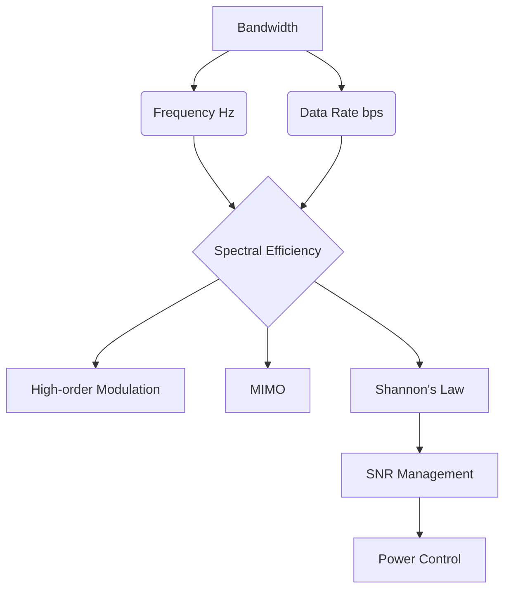

+++
title = "NW #13 대역폭 (Bandwidth) 및 대역폭-효율성 관계"
date = 2026-03-14
[extra]
categories = "studynote-network"
+++

# NW #13 대역폭 (Bandwidth) 및 대역폭-효율성 관계

> **핵심 인사이트**: 대역폭(Bandwidth)은 통신 시스템이 수용할 수 있는 주파수 범위 또는 정보 전송 능력을 의미하며, 대역폭 효율성(Spectral Efficiency)은 한정된 주파수 자원 내에서 얼마나 많은 정보를 실어 나를 수 있는지를 나타내는 네트워크 성능의 핵심 척도이다.

---

## Ⅰ. 대역폭 (Bandwidth)의 정의와 두 가지 관점

### 1. 주파수 영역 대역폭 (Hertz, Hz)
- 신호가 차지하는 상한 주파수와 하한 주파수의 차이 ($B = f_{high} - f_{low}$).
- 물리적 매체의 전송 특성에 의해 결정되는 아날로그적 범위.

### 2. 데이터 전송 대역폭 (Bit per second, bps)
- 단위 시간당 전송 가능한 최대 비트 수.
- 채널의 품질(SNR)과 변조 방식(M-ary)에 따라 결정되는 디지털적 용량.

```ascii
[ Frequency Domain View ]          [ Data Rate View ]
       Power                              Bits
         ^                                 | 01101011 |
         |   Bandwidth (Hz)                |----------|
         |  <------------>                 |  1 sec   |
         |      ____                       |          |
    -----+-----/    \-----+-----> f        +----------+
        f1               f2               Max: XXX Mbps
```

📢 **섹션 요약 비유**: 주파수 대역폭이 '도로의 물리적 폭(차선 수)'이라면, 데이터 대역폭은 그 도로를 통해 1초 동안 지나갈 수 있는 '차량의 총 대수'와 같습니다.

---

## Ⅱ. 대역폭 효율성 (Spectral Efficiency)의 메커니즘

대역폭 효율성은 단위 주파수(1Hz)당 전송 가능한 비트 속도를 의미하며, 단위는 `bps/Hz`를 사용한다.

### 1. 산출 공식
$$\eta = \frac{R}{B} \quad [\text{bps/Hz}]$$
- $R$: 데이터 전송률 (Data Rate, bps)
- $B$: 사용 주파수 대역폭 (Bandwidth, Hz)

### 2. 효율성 증대 기술
- **고차 변조 (High-order Modulation)**: QPSK(2bit) → 256QAM(8bit)으로 심볼당 비트 수 증가.
- **다중 안테나 (MIMO)**: 공간 다중화를 통해 주파수 추가 없이 용량 증대.
- **주파수 재사용 (Frequency Reuse)**: 지리적 분할을 통한 자원 효율 극대화.

📢 **섹션 요약 비유**: 한 대의 버스에 승객을 10명 태우느냐(QPSK), 100명 태우느냐(QAM)의 차이가 바로 대역폭 효율성입니다.

---

## Ⅲ. 대역폭-효율성 관계의 트레이드오프 (Trade-off)

대역폭과 효율성, 전력 사이에는 Shannon의 정리에 따른 상충 관계가 존재한다.

| 구분 | 대역폭 확대 시 | 효율성(고차변조) 증대 시 |
|:---:|:---|:---|
| **장점** | 전송 속도 $C$ 선형적 증가 | 한정된 자원 내 용량 극대화 |
| **단점** | 잡음 전력($N=N_0B$) 증가로 SNR 저하 | 심볼 간격 조밀화로 에러율(BER) 상승 |
| **적용** | 초광대역 통신 (mmWave) | 주파수 부족 환경 (Cellular) |

```ascii
[ Bandwidth vs. Power vs. Efficiency ]
      
      High SNR  --->  Higher Efficiency (256-QAM)
         ^                 |
         |   Trade-off     |  Complexity Up
         |                 v
      Low SNR   --->  Robustness (BPSK)
```

📢 **섹션 요약 비유**: 도로를 넓히면 차가 빨리 달릴 수 있지만 유지비가 많이 들고, 같은 도로에 차를 빽빽하게 밀어 넣으면 사고(에러) 위험이 커지는 것과 같습니다.

---

## Ⅳ. 대역폭 효율 최적화 기술 동향

### 1. 직교 주파수 분할 다중화 (OFDM: Orthogonal Frequency Division Multiplexing)
- 부반송파 간 직교성을 유지하여 보호 대역(Guard Band)을 최소화함으로써 대역폭 낭비 방지.

### 2. 주파수 집성 (CA: Carrier Aggregation)
- 흩어진 여러 대역을 하나로 묶어 광대역 효과를 창출하여 체감 효율 향상.

### 3. 필터링 기술 (Pulse Shaping)
- 나이퀴스트 필터를 적용하여 대역 외 방사(Out-of-band Emission)를 억제하고 간섭 최소화.

📢 **섹션 요약 비유**: 주차장에서 차들 사이의 간격을 아주 정교하게(직교성) 배치하여 한 대라도 더 주차할 공간을 확보하는 기술들입니다.

---

## Ⅴ. 전문가 제언: 미래 통신에서의 의미

6G 이동통신에서는 테라헤르츠(THz) 대역의 초광대역 확보와 동시에, AI 기반의 적응형 변조 기술을 통한 극한의 대역폭 효율성을 추구하고 있다. 단순한 속도 경쟁을 넘어, 주어진 자원 내에서 **에너지 효율(Energy Efficiency)**과 **주파수 효율(Spectral Efficiency)**의 균형을 맞추는 것이 차세대 네트워크 설계의 핵심 과제가 될 것이다.

---

## 💡 개념 맵 (Knowledge Graph)



---

## 👶 어린이 비유
- **대역폭**: 장난감을 담는 '상자의 크기'입니다. 큰 상자일수록 장난감을 많이 담을 수 있어요.
- **효율성**: 상자 안에 장난감을 얼마나 '차곡차곡 예쁘게 채워 넣느냐'입니다. 잘 쌓으면 작은 상자에도 많이 들어가죠.
- **결론**: 상자가 아주 크거나, 장난감을 아주 잘 쌓으면 우리는 더 많은 장난감을 가질 수 있답니다!
