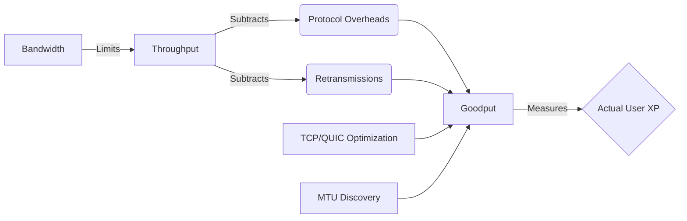

+++
title = "NW #14 처리량 (Throughput) 및 굿풋 (Goodput)"
date = 2026-03-14
[extra]
categories = "studynote-network"
+++

# NW #14 처리량 (Throughput) 및 굿풋 (Goodput)

> **핵심 인사이트**: 대역폭(Bandwidth)이 잠재적인 최대 전송 능력을 의미한다면, 처리량(Throughput)은 실제 전송된 데이터의 양을, 굿풋(Goodput)은 그중 오버헤드와 오류를 제외한 순수 응용 계층 데이터의 유효 전송량을 의미하는 실제 성능 지표이다.

---

## Ⅰ. 대역폭, 처리량, 굿풋의 위계적 이해

### 1. 처리량 (Throughput)
- 특정 기간 동안 노드 간에 성공적으로 전송된 데이터의 비율 (bps).
- 하드웨어 한계, 전송 매체 특성, 네트워크 혼잡 등에 의해 결정됨.

### 2. 굿풋 (Goodput)
- 응용 계층(Application Layer) 관점에서 본 유효 전송 속도.
- 처리량에서 **프로토콜 오버헤드(Header)**와 **재전송(Retransmission)**된 패킷을 제외한 순수 데이터량.

```ascii
[ Hierarchical Structure ]
+-----------------------------------------------------------+
|  Bandwidth (Theoretical Max)                              |
|  +-----------------------------------------------------+  |
|  |  Throughput (Actual Data bits + Headers + Re-tx)    |  |
|  |  +-----------------------------------------------+  |  |
|  |  |  Goodput (Pure User Data only)                |  |  |
|  |  +-----------------------------------------------+  |  |
|  +-----------------------------------------------------+  |
+-----------------------------------------------------------+
```

📢 **섹션 요약 비유**: 대역폭이 '트럭이 다닐 수 있는 최대 속도'라면, 처리량은 '실제 트럭이 달린 속도'이고, 굿풋은 '트럭에 실린 물건 중 파손되지 않고 도착한 진짜 상품의 양'입니다.

---

## Ⅱ. 굿풋(Goodput) 산출 공식과 영향 요소

굿풋은 네트워크 효율성을 판단하는 가장 실질적인 척도이다.

### 1. 산출 공식
$$\text{Goodput} = \frac{\text{순수 유저 데이터 크기}}{\text{총 전송 시간}}$$
또는
$$\text{Goodput} = \text{Throughput} \times (1 - \text{오버헤드 비율}) \times (1 - \text{패킷 손실률})$$

### 2. 성능 저하 요인
- **프로토콜 오버헤드**: TCP/IP 헤더, 이더넷 프레임 오버헤드.
- **네트워크 혼잡 (Congestion)**: 패킷 유실로 인한 재전송 발생.
- **애플리케이션 처리 지연**: 서버/클라이언트의 데이터 처리 병목.

📢 **섹션 요약 비유**: 택배를 보낼 때 상자가 너무 크면(오버헤드) 트럭에 많이 못 싣고, 배송 중에 상자가 터져서 다시 보내면(재전송) 실제 받는 물건은 줄어드는 원리입니다.

---

## Ⅲ. 처리량(Throughput) 최적화를 위한 핵심 기술

| 기술 구분 | 상세 내용 | 기대 효과 |
|:---:|:---|:---|
| **슬라이딩 윈도우** | 수신측 확인 없이 여러 패킷 연속 전송 | 전송 효율(Utilization) 극대화 |
| **MTU 최적화** | 경로 상 최대 전송 단위(Path MTU) 적용 | 단편화(Fragmentation) 방지 |
| **압축 (Compression)** | 데이터 중복 제거 후 전송 | 동일 대역폭 내 굿풋 향상 |
| **Zero-Copy** | 커널-유저 메모리 복사 단계 생략 | OS 내부 처리량 병목 해결 |

```ascii
[ Window Size and Throughput ]
        
    Sender                      Receiver
      |----P1---->|                |
      |----P2---->|                |  High Throughput
      |----P3---->|                |  (Pipe Filling)
      |<---ACK----|                |
```

📢 **섹션 요약 비유**: 수도꼭지에서 물을 한 방울씩 받는 것이 아니라, 호스를 가득 채워(윈도우) 한꺼번에 쏟아붓는 방식이 처리량을 높이는 길입니다.

---

## Ⅳ. 굿풋 극대화를 위한 전송 계층 전략 (QUIC 사례)

### 1. 0-RTT 핸드셰이크
- 연결 설정 시간을 단축하여 전체 전송 시간 대비 유효 데이터 전송 시간 비중 확대.

### 2. 멀티플렉싱 (Multiplexing)
- 하나의 연결 내에서 여러 스트림을 독립적으로 처리하여 HOL(Head-of-Line) 블로킹에 의한 굿풋 저하 방지.

📢 **섹션 요약 비유**: 통행료 계산(연결 설정) 시간을 줄이고 여러 차선(멀티플렉싱)을 동시에 열어 물류 흐름을 끊기지 않게 하는 최신 기법들입니다.

---

## Ⅴ. 전문가 제언: 성능 평가의 관점 전환

네트워크 엔지니어는 단순한 **Link Speed(bps)**에 매몰되어서는 안 된다. 사용자 경험(UX)에 직접적인 영향을 미치는 것은 **Goodput**과 **Latency**의 조합이다. 특히 패킷 유실이 잦은 무선 환경이나 대용량 트래픽이 몰리는 데이터센터에서는 하드웨어 대역폭 증설보다 **TCP 혼잡 제어 알고리즘 최적화**나 **오버헤드 절감 기술**을 통한 굿풋 개선이 훨씬 비용 효율적일 수 있다.

---

## 💡 개념 맵 (Knowledge Graph)



---

## 👶 어린이 비유
- **대역폭**: 아주 넓은 '피자 박스'입니다. 피자를 많이 담을 수 있는 잠재력이에요.
- **처리량**: 실제로 박스에 담아 배달하는 '피자 조각들'입니다.
- **굿풋**: 피자 박스 안에서 '토핑이 망가지지 않고 먹을 수 있게 도착한 진짜 맛있는 피자'입니다.
- **결론**: 박스가 아무리 커도 피자가 다 쏟아져서 오면 소용없겠죠? 진짜 먹을 수 있는 피자(굿풋)가 많아야 좋은 배달입니다!
