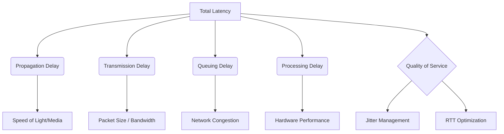

+++
title = "NW #15 지연 (Latency/Delay) - 데이터 관점"
date = 2026-03-14
[extra]
categories = "studynote-network"
+++

# NW #15 지연 (Latency/Delay) - 데이터 관점

> **핵심 인사이트**: 네트워크 지연(Latency/Delay)은 데이터가 소스에서 목적지까지 도달하는 데 걸리는 총 시간으로, 단순한 물리적 거리를 넘어 전송, 큐잉, 처리 단계의 합산이며, 사용자 경험(UX)과 대화형 서비스의 품질을 결정짓는 핵심 지표이다.

---

## Ⅰ. 네트워크 지연(Latency)의 4대 구성 요소

총 지연 시간($D_{total}$)은 다음과 같은 요소들의 합으로 정의된다.

$$D_{total} = d_{prop} + d_{trans} + d_{queue} + d_{proc}$$

| 지연 종류 | 원인 및 특성 | 영향 요인 |
|:---:|:---|:---|
| **전파 지연 ($d_{prop}$)** | 신호가 물리적 매체를 이동하는 속도 | 물리적 거리, 매체의 굴절률 |
| **전송 지연 ($d_{trans}$)** | 모든 비트를 링크로 밀어내는 데 걸리는 시간 | 패킷 크기($L$), 대역폭($R$) |
| **큐잉 지연 ($d_{queue}$)** | 라우터 버퍼에서 전송을 기다리는 시간 | 트래픽 부하, 혼잡 정도 |
| **처리 지연 ($d_{proc}$)** | 헤더 분석, 에러 검사 등에 걸리는 시간 | 라우터 하드웨어 성능 |

```ascii
[ End-to-End Delay Breakdown ]

    Node A --------( d_prop )--------> Node B
      |                                  |
   (d_trans) -> [Buffer] -> (d_proc) -> (d_trans)
                   ^
                (d_queue)
```

📢 **섹션 요약 비유**: 택배 배송 시 '서울에서 부산까지 가는 시간(전파)' + '상자를 트럭에 싣는 시간(전송)' + '물류센터에서 대기하는 시간(큐잉)' + '송장을 확인하는 시간(처리)'을 모두 합친 것이 총 배송 지연입니다.

---

## Ⅱ. 지연 시간의 측정 단위와 변동성

### 1. RTT (Round Trip Time)
- 패킷을 보내고 응답을 받을 때까지의 왕복 시간.
- 네트워크의 양방향 성능을 측정하는 가장 보편적인 지표.

### 2. 지터 (Jitter)
- 지연 시간의 변동성(Variance in Latency).
- 실시간 음성/영상 서비스에서 패킷 도착 간격이 불규칙해져 품질을 저하시키는 주요 요인.

📢 **섹션 요약 비유**: 택배가 매번 2일 만에 오다가, 어느 날은 1일, 어느 날은 5일이 걸린다면 그 불규칙한 정도가 바로 '지터'입니다.

---

## Ⅲ. 지연 시간 단축을 위한 네트워크 기술

| 영역 | 기술 명칭 | 핵심 메커니즘 |
|:---:|:---|:---|
| **물리/엣지** | CDN (Content Delivery Network) | 서버를 사용자 물리적 위치 근처로 전진 배치 (전파 지연 감소) |
| **라우팅** | MEC (Multi-access Edge Computing) | 기지국 인근에서 데이터 처리 (백홀 지연 제거) |
| **QoS 관리** | PQ (Priority Queuing) | 실시간 트래픽에 우선순위를 부여하여 대기 시간 단축 (큐잉 지연 감소) |
| **전송 계층** | Fast Open / 0-RTT | 연결 설정 단계의 왕복 횟수 제거 (RTT 체감 단축) |

```ascii
[ Latency Reduction: Edge Computing ]
    
    Cloud (100ms) ----X----> User
    
    Edge Server (5ms) <----> User  (Low Latency)
```

📢 **섹션 요약 비유**: 전국 어디서든 본사에서 택배를 보내는 대신, 우리 동네 편의점(엣지)에 미리 물건을 가져다 놓으면 배송 시간이 획기적으로 줄어듭니다.

---

## Ⅳ. 전문가 제언: '지연'과 '대역폭'의 상호관계

고속 인터넷 시대에는 대역폭보다 **지연 시간(Latency)**이 병목이 되는 경우가 많다. 1Gbps 회선을 쓰더라도 RTT가 500ms라면 웹 페이지 로딩은 느리게 느껴진다. 이를 **'LFC(Latency First Computing)'**라 부르며, 특히 자율주행, 원격 수술, 클라우드 게임과 같은 초저지연(URLLC) 요구 서비스에서는 지연 시간의 밀리초(ms) 단위 관리가 서비스 성패를 가르는 절대적 기준이 된다.

---

## 💡 개념 맵 (Knowledge Graph)



---

## 👶 어린이 비유
- **지연**: 친구에게 말을 걸었을 때, 친구가 "응?" 하고 대답할 때까지 걸리는 시간이에요.
- **전파 지연**: 내 목소리가 공기 중을 타고 친구 귀까지 날아가는 시간이에요.
- **큐잉 지연**: 친구가 다른 사람이랑 이야기하고 있어서 내 말을 기다려야 하는 시간이에요.
- **결론**: 대답이 아주 빠르면 재미있게 놀 수 있지만, 대답이 너무 늦으면 답답하겠죠? 네트워크도 대답이 빨라야 좋은 네트워크랍니다!
