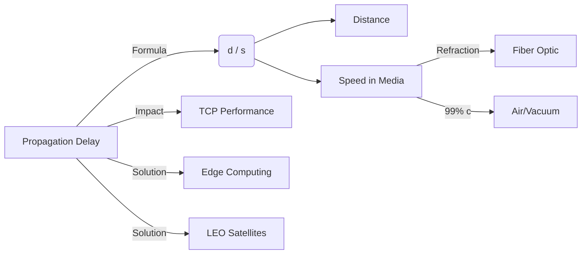

+++
title = "NW #16 전파 지연 (Propagation Delay) - 거리/속도"
date = 2026-03-14
[extra]
categories = "studynote-network"
+++

# NW #16 전파 지연 (Propagation Delay) - 거리/속도

> **핵심 인사이트**: 전파 지연(Propagation Delay)은 신호가 물리적 전송 매체(구리, 광섬유, 공기 등)를 통해 두 노드 사이를 이동하는 데 걸리는 물리적 시간으로, 전송 속도와 무관하게 오직 **거리**와 **매체 내 전파 속도**에 의해 결정되는 불가항력적 요소이다.

---

## Ⅰ. 전파 지연 ($d_{prop}$)의 산출 공식

전파 지연은 물리 법칙에 근거하며, 다음과 같은 단순한 산식으로 결정된다.

$$d_{prop} = \frac{d}{s}$$

- $d$: 두 노드 간의 물리적 거리 (Distance, m)
- $s$: 매체 내에서의 전파 속도 (Propagation Speed, m/s)

```ascii
[ Propagation Mechanism ]

    Node A (Transmitter)      Distance (d)      Node B (Receiver)
       | <-------------------------------------------> |
       |                                               |
   [Signal Start] ------ (v = s) ------> [Signal Arrival]
       |                                               |
    t = 0                                           t = d/s
```

📢 **섹션 요약 비유**: 전파 지연은 서울에서 부산까지 '자동차(신호)가 고속도로를 달리는 순수한 주행 시간'과 같습니다.

---

## Ⅱ. 매체별 전파 속도 ($s$)의 차이

신호가 진공 상태가 아닌 실제 매체를 통과할 때는 속도가 줄어든다.

| 전송 매체 | 전파 속도 (근사치) | 광속($c$) 대비 비율 |
|:---:|:---|:---|
| **진공 (Vacuum)** | $3.0 \times 10^8$ m/s | 100% |
| **광섬유 (Fiber)** | 약 $2.0 \times 10^8$ m/s | 약 67% (굴절률 $n \approx 1.5$) |
| **구리선 (Copper)** | 약 $2.3 \times 10^8$ m/s | 약 75% |
| **자유 공간 (Air)** | 약 $3.0 \times 10^8$ m/s | 99% 이상 |

📢 **섹션 요약 비유**: 진공 상태는 공기 저항 없는 매끄러운 빙판길이고, 광섬유는 모래가 섞인 길이라 속도가 조금 줄어드는 것과 같습니다.

---

## Ⅲ. 전파 지연이 네트워크 성능에 미치는 영향

전파 지연은 특히 장거리 통신에서 병목 현상의 주범이 된다.

### 1. 지상파 vs 위성 통신
- **지상 광케이블 (1,000km)**: 전파 지연 약 5ms.
- **정지 궤도 위성 (GEO, 36,000km)**: 편도 약 120ms, 왕복(RTT) 약 500ms 이상의 막대한 지연 발생.

### 2. TCP 성능 저하 (BDP)
- 전파 지연이 길수록 확인 응답(ACK)이 늦게 도착하여 윈도우 확장이 지체됨.
- **BDP (Bandwidth-Delay Product)**: 링크에 떠 있는 데이터 양이 많아져 버퍼 관리의 난도가 상승함.

```ascii
[ High Latency Link (Satellite) ]

    Earth Stn A --(120ms UP)--> Satellite --(120ms DOWN)--> Earth Stn B
                                                               |
    <-------(Total 240ms Propagation One-way)------------------|
```

📢 **섹션 요약 비유**: 편지를 보낼 때, 쓰는 속도(전송)가 아무리 빨라도 우체국 차가 멀리(전파) 가야 한다면 대화가 뚝뚝 끊기는 것과 같습니다.

---

## Ⅳ. 전파 지연 극복 전략

전파 지연은 빛의 속도라는 물리적 한계가 있으므로, **'거리'**를 줄이는 것이 유일한 해결책이다.

| 해결 전략 | 상세 내용 |
|:---:|:---|
| **Edge Computing** | 서버를 사용자 물리적 위치로 전진 배치하여 $d$ 감소. |
| **LEO Satellite** | 저궤도 위성(Starlink 등)을 통해 궤도 고도를 3.6만km에서 550km로 낮추어 지연 90% 절감. |
| **Direct Peering** | 통신사 간 IX(Internet Exchange)를 직접 연결하여 경로 우회 방지. |

📢 **섹션 요약 비유**: 전국 택배를 기다리는 대신 집 앞 편의점에 물건을 미리 갖다 놓는 것이 물리적 거리를 이기는 최고의 방법입니다.

---

## Ⅴ. 전문가 제언: 초저지연 시대의 물리 계층 설계

6G와 자율주행 시대의 요구 사항인 1ms 지연 시간(End-to-End)을 달성하기 위해, 전파 지연 관리는 필수적이다. 광섬유 내부의 굴절률에 의한 속도 저하조차 아까운 상황에서, 최근에는 속도가 더 빠른 **공기 코어 광섬유(Hollow Core Fiber)**나 **대기권 자유 공간 광통신(FSO)** 연구가 활발하다. 결국 네트워크 최적화의 끝은 '빛의 속도를 어떻게 보존하느냐'의 싸움이 될 것이다.

---

## 💡 개념 맵 (Knowledge Graph)



---

## 👶 어린이 비유
- **전파 지연**: 내가 "야!" 하고 불렀을 때, 목소리가 친구 귀까지 날아가는 '이동 시간'이에요.
- **거리**: 친구가 멀리 있을수록 목소리가 늦게 도착하겠죠?
- **속도**: 목소리는 공기보다 물속에서 조금 더 느려질 수 있어요.
- **결론**: 친구가 바로 옆에 있으면 아주 빨리 대화할 수 있듯이, 거리가 가까워야 전파 지연이 줄어든답니다!
