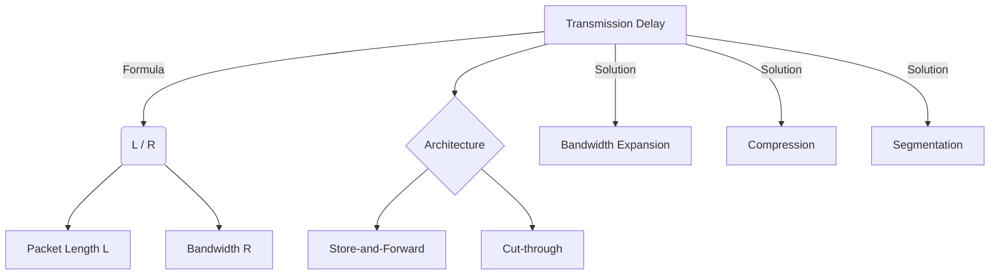

+++
title = "NW #17 전송 지연 (Transmission Delay) - 패킷길이/대역폭"
date = 2026-03-14
[extra]
categories = "studynote-network"
+++

# NW #17 전송 지연 (Transmission Delay) - 패킷길이/대역폭

> **핵심 인사이트**: 전송 지연(Transmission Delay)은 데이터 패킷의 모든 비트를 링크(매체)로 밀어내는 데 걸리는 시간으로, 패킷의 크기($L$)와 링크의 전송 대역폭($R$)에 정비례 및 반비례하는 정보 통신의 물리적 병목 요소이다.

---

## Ⅰ. 전송 지연 ($d_{trans}$)의 산출 공식

전송 지연은 호스트 또는 라우터가 물리적 매체에 비트들을 실어 나르는 능력을 나타낸다.

$$d_{trans} = \frac{L}{R}$$

- $L$: 패킷의 총 길이 (Packet Length, Bits)
- $R$: 링크의 전송 속도/대역폭 (Transmission Rate, bps)

```ascii
[ Transmission Mechanism ]

    Packet (L bits)           Link Bandwidth (R bps)
    +-----------+               _________________
    | 1011...01 | ------------> |               |
    +-----------+               |_______________|
       Input                        Pipe

    Time Start: t = 0 (First bit pushed)
    Time End:   t = L/R (Last bit pushed)
```

📢 **섹션 요약 비유**: 전송 지연은 '모래시계의 모래(패킷)가 구멍(대역폭)을 통해 아래로 다 빠져나가는 데 걸리는 시간'과 같습니다.

---

## Ⅱ. 전송 지연 vs 전파 지연 (비교 분석)

두 개념은 혼동하기 쉬우나, 네트워크 성능 분석 시 명확히 구분해야 한다.

| 구분 | 전송 지연 ($d_{trans}$) | 전파 지연 ($d_{prop}$) |
|:---:|:---|:---|
| **결정 요인** | 패킷 크기($L$), 대역폭($R$) | 물리적 거리($d$), 매체 속도($s$) |
| **물리적 의미** | 패킷이 링크로 '나가는' 시간 | 신호가 목적지까지 '가는' 시간 |
| **최적화 방법** | 대역폭 증설, 패킷 압축 | 물리적 거리 단축 (CDN 등) |

📢 **섹션 요약 비유**: 편지 100장을 봉투에 '넣는 시간'이 전송 지연이고, 그 봉투를 실은 우체국 차가 목적지까지 '달리는 시간'이 전파 지연입니다.

---

## Ⅲ. 전송 지연이 스위칭에 미치는 영향 (Store-and-Forward)

현대 네트워크 스위칭의 주류인 **Store-and-Forward** 방식은 전송 지연을 누적시킨다.

### 1. 홉별 누적 지연
- 라우터가 패킷을 다음 노드로 보내려면 전체 패킷을 수신(Store)한 뒤 다시 전송(Forward)해야 한다.
- 홉(Hop) 수가 $N$일 때, 총 전송 지연은 $N \times (L/R)$이 된다.

### 2. 컷스루 (Cut-through) 스위칭의 대안
- 패킷 헤더만 보고 즉시 전송을 시작하여 $d_{trans}$ 누적을 최소화함 (데이터센터 고성능 스위치 적용).

```ascii
[ Hop-by-Hop Transmission Delay ]

    Host A --(L/R)--> Router --(L/R)--> Host B
       |                |                |
       |  [ Receive ]   |  [ Forward ]   |
       |<-------------->|<-------------->|
             t1               t2
```

📢 **섹션 요약 비유**: 이어달리기에서 바통을 완전히 건네받아야만(Store) 다음 사람이 뛸 수 있는(Forward) 것과 같습니다.

---

## Ⅳ. 전송 지연 최적화 전략

| 전략 | 상세 내용 | 비고 |
|:---:|:---|:---|
| **대역폭 증설 (Scale-up)** | 1Gbps → 10Gbps로 $R$ 증가. | 분모($R$)를 키워 지연 단축. |
| **패킷 분할 (Segmentation)** | 큰 데이터를 작은 패킷으로 나누어 파이프라이닝. | 첫 패킷 도착 시간 단축. |
| **압축 (Compression)** | 데이터 크기 $L$ 감소. | 분자($L$)를 줄여 지연 단축. |

📢 **섹션 요약 비유**: 수도꼭지(대역폭)를 크게 틀거나, 물탱크를 작게(패킷 크기) 나누어 여러 개로 보내는 방식입니다.

---

## Ⅴ. 전문가 제언: 패킷 크기(MTU) 설계의 중요성

네트워크 설계 시 **MTU (Maximum Transmission Unit)**를 무작정 크게 잡는 것이 능사는 아니다. MTU가 커지면 한 번에 보내는 양은 많아지지만, 저속 링크(Low $R$)에서는 전송 지연이 급격히 늘어나 실시간 트래픽(VoIP 등)의 응답성을 해칠 수 있다. 따라서 링크의 대역폭과 애플리케이션의 지연 민감도를 고려하여 최적의 패킷 크기를 결정하는 **'성능 튜닝'** 역량이 시니어 엔지니어의 핵심 차별점이 된다.

---

## 💡 개념 맵 (Knowledge Graph)



---

## 👶 어린이 비유
- **전송 지연**: 사탕 100개를 작은 구멍에 하나씩 넣어서 통과시키는 데 걸리는 시간이에요.
- **사탕 수**: 사탕이 많을수록 시간이 오래 걸려요 (패킷 크기).
- **구멍 크기**: 구멍이 넓을수록 사탕이 쑥쑥 잘 빠져나가요 (대역폭).
- **결론**: 사탕을 조금씩 나누어 넣거나, 구멍을 아주 크게 만들면 더 빨리 사탕을 보낼 수 있답니다!
