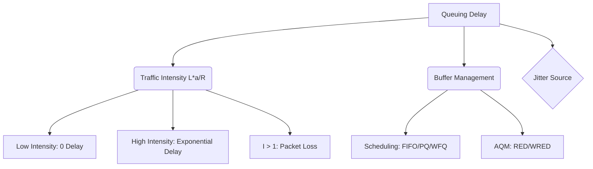

+++
title = "NW #18 큐잉 지연 (Queueing Delay) - 라우터 버퍼"
date = 2026-03-14
[extra]
categories = "studynote-network"
+++

# NW #18 큐잉 지연 (Queueing Delay) - 라우터 버퍼

> **핵심 인사이트**: 큐잉 지연(Queueing Delay)은 패킷이 라우터의 출력 링크를 통해 전송되기 전 버퍼에서 대기하는 시간으로, 네트워크 트래픽의 불확실성과 혼잡(Congestion)을 나타내는 가장 변동성이 큰 지연 요소이다.

---

## Ⅰ. 큐잉 지연의 발생 원리와 트래픽 강도 ($L \cdot a/R$)

라우터의 버퍼는 입력 속도가 출력 속도보다 일시적으로 빠를 때 패킷을 저장하는 역할을 한다.

### 1. 주요 영향 요소
- $a$: 평균 패킷 도착률 (Average Arrival Rate, packets/sec)
- $L$: 패킷의 길이 (Length, bits)
- $R$: 전송 대역폭 (Transmission Rate, bps)

### 2. 트래픽 강도 (Traffic Intensity)
- 산식: $I = \frac{L \cdot a}{R}$
- **$I \approx 0$**: 패킷이 거의 도착하지 않음. 큐잉 지연이 0에 수렴.
- **$I \to 1$**: 도착률이 전송률에 근접. 큐잉 지연이 기하급수적으로 증가.
- **$I > 1$**: 버퍼가 가득 차 패킷 유실(Packet Loss) 발생.

```ascii
[ Router Buffer and Queuing ]

   Inbound Traffic (a)          Queue (Buffer)          Outbound (R)
   ===================> [ P3 ][ P2 ][ P1 ] --------> R bps
                                ^
                          Queuing Delay
```

📢 **섹션 요약 비유**: 큐잉 지연은 '고속도로 요금소 앞에서 내 차례가 올 때까지 대기하는 시간'과 같습니다. 차가 많아질수록(강도 증가) 대기 시간은 급격히 길어집니다.

---

## Ⅱ. 큐잉 지연과 확률적 특성 (지터의 원인)

전송 지연이나 전파 지연과 달리 큐잉 지연은 **확률적(Probabilistic)**이며 예측이 어렵다.

### 1. 지터 (Jitter)의 발생
- 패킷마다 버퍼에 쌓여 있는 대기열의 길이가 다르기 때문에, 도착 간격이 불규칙해짐.
- 실시간 멀티미디어(VoIP, 화상회의) 품질 저하의 주범.

### 2. 버퍼 오버플로우 (Buffer Overflow)
- 트래픽이 버퍼 용량을 초과하면 나중에 온 패킷부터 폐기(Tail-drop)되는 현상.

📢 **섹션 요약 비유**: 요금소 대기 시간이 매번 1분, 10분, 30분으로 제각각이라면, 약속 장소에 도착하는 시간(지터)도 엉망이 되는 것과 같습니다.

---

## Ⅲ. 큐잉 지연 관리 및 최적화 기술 (QoS)

| 기술 명칭 | 핵심 메커니즘 | 기대 효과 |
|:---:|:---|:---|
| **FIFO (First-In-First-Out)** | 먼저 들어온 패킷을 먼저 처리 | 가장 단순하지만 우선순위 보장 불가 |
| **PQ (Priority Queuing)** | 중요 패킷(Voice 등)을 먼저 처리 | 지연 민감 트래픽의 큐잉 지연 최소화 |
| **WFQ (Weighted Fair Queuing)** | 가중치에 따라 대역폭 분배 | 여러 트래픽 간의 공정성 및 지연 관리 |
| **RED (Random Early Detection)** | 버퍼가 꽉 차기 전 패킷을 미리 폐기 | TCP 혼잡 제어 유도 및 큐 폭주 방지 |

```ascii
[ Priority Queuing Model ]

    High Priority Queue [ V ][ V ][ V ] ----\
                                             > [ Output Link ]
    Low  Priority Queue [ D ][ D ][ D ] ----/
```

📢 **섹션 요약 비유**: 구급차(우선순위 패킷)에게 전용 차로를 열어주어 요금소를 가장 먼저 통과하게 하는 시스템이 바로 PQ입니다.

---

## Ⅳ. 전문가 제언: 버퍼 사이즈 산정의 딜레마

과거에는 대용량 버퍼가 좋다고 여겨졌으나, 최근에는 **'Bufferbloat(버퍼팽창)'** 현상이 문제가 되고 있다. 너무 큰 버퍼는 패킷을 버리지 않고 무작정 들고 있어 큐잉 지연을 수백 ms까지 늘리고, 결과적으로 TCP의 혼잡 제어 반응을 늦춘다. 따라서 현대 네트워크 설계에서는 지연 시간(Latency)과 처리량(Throughput) 사이의 균형을 맞추기 위해 **AQM(Active Queue Management)** 기술을 적극적으로 도입해야 한다.

---

## 💡 개념 맵 (Knowledge Graph)



---

## 👶 어린이 비유
- **큐잉 지연**: 마트에서 물건을 계산하려고 '줄을 서서 기다리는 시간'이에요.
- **계산대**: 계산원 아저씨가 물건을 찍는 속도가 네트워크의 대역폭이에요.
- **줄**: 손님이 갑자기 많아지면 줄이 길어지고 기다리는 시간도 늘어나요.
- **결론**: 계산대 아저씨가 아주 빠르거나, 손님이 적당히 오면 줄을 서지 않고 바로 나갈 수 있답니다!
