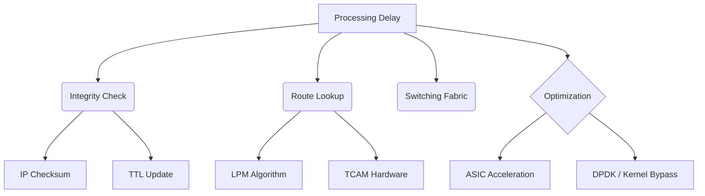

+++
title = "NW #19 처리 지연 (Processing Delay) - 헤더 검사, 라우팅"
date = 2026-03-14
[extra]
categories = "studynote-network"
+++

# NW #19 처리 지연 (Processing Delay) - 헤더 검사, 라우팅

> **핵심 인사이트**: 처리 지연(Processing Delay)은 패킷이 라우터에 도착했을 때 헤더 분석, 오류 검출, 다음 경로(Output Interface) 결정을 위해 수행되는 연산 시간으로, 현대 라우터에서는 ASIC 하드웨어 가속을 통해 마이크로초(μs) 단위로 최소화되고 있다.

---

## Ⅰ. 처리 지연의 주요 수행 단계

패킷이 라우터의 입력 포트에 도착하면 다음과 같은 작업을 거친다.

### 1. 헤더 분석 및 오류 검사
- IP 헤더의 체크섬(Checksum)을 검증하여 손상 여부 확인.
- TTL(Time to Live) 값을 1 감소시키고 0일 경우 패킷 폐기(ICMP 전송).

### 2. 라우팅 테이블 조회 (Lookup)
- 패킷의 목적지 IP 주소를 기반으로 포워딩 테이블(FIB)을 검색.
- 가장 긴 일치 접두사(LPM: Longest Prefix Match) 알고리즘 수행.

### 3. 스위칭 구조(Switching Fabric) 통과
- 입력 포트에서 결정된 출력 포트로 패킷을 물리적으로 이동.

```ascii
[ Processing Flow in Router ]

   Arrival ---> [ Checksum / TTL ] ---> [ FIB Lookup ] ---> [ Fabric ] ---> To Output Queue
                  ^                      ^                    ^
             Packet Integrity       Path Decision        Internal Movement
```

📢 **섹션 요약 비유**: 처리 지연은 '우체국 직원이 택배 상자의 주소를 읽고, 어느 지역 차에 실을지 결정하는 데 걸리는 시간'과 같습니다.

---

## Ⅱ. 처리 지연 최적화를 위한 핵심 기술

지연 시간을 줄이기 위해 소프트웨어 처리 방식에서 하드웨어 기반으로 진화해 왔다.

| 기술 명칭 | 상세 메커니즘 | 기대 효과 |
|:---:|:---|:---|
| **ASIC / FPGA 가속** | 전용 칩셋에서 라우팅 로직을 하드웨어로 구현 | 처리 지연을 수십 ns ~ μs 수준으로 고정 |
| **CEF (Cisco Express Forwarding)** | 라우팅 정보를 미리 FIB/Adjacency Table로 구성 | 인터럽트 없는 고속 포워딩 실현 |
| **TCAM (Ternary Content Addressable Memory)** | 병렬 검색 하드웨어 메모리 | 단 한 번의 클럭으로 주소 조회 완료 |

📢 **섹션 요약 비유**: 주소를 눈으로 하나하나 읽는 대신, 바코드 스캐너(ASIC/TCAM)로 '띡' 찍어 순식간에 분류하는 것과 같습니다.

---

## Ⅲ. 처리 지연과 다른 지연 요소의 관계

현대 고속 네트워크에서 처리 지연은 다른 지연 요소에 비해 상대적으로 비중이 작다.

| 지연 종류 | 일반적 시간 단위 | 비중 변화 추세 |
|:---:|:---|:---|
| **전파 지연 ($d_{prop}$)** | ms (밀리초) | **절대적 지배 요소** (거리 한계) |
| **전송 지연 ($d_{trans}$)** | μs ~ ms | 대역폭 확대에 따라 감소 중 |
| **큐잉 지연 ($d_{queue}$)** | 0 ~ 수백 ms | 트래픽 혼잡 시 최대 변수 |
| **처리 지연 ($d_{proc}$)** | **μs (마이크로초)** | 하드웨어 발전에 따라 **최소화됨** |

📢 **섹션 요약 비유**: 택배 배송 전체 시간에서 주소 확인 시간(처리)은 아주 짧지만, 길이 막히는 시간(큐잉)이나 주행 거리(전파)는 훨씬 큽니다.

---

## Ⅳ. 전문가 제언: SDN 및 가상화 환경에서의 이슈

최근의 **SDN(Software Defined Networking)**이나 **NFV(가상화)** 환경에서는 전용 ASIC 대신 범용 CPU(x86)에서 패킷을 처리하는 경우가 많다. 이 경우 처리 지연이 다시 늘어날 수 있는데, 이를 해결하기 위해 **DPDK(Data Plane Development Kit)**나 **SR-IOV** 같은 커널 우회 기술을 사용하여 처리 성능을 극대화하는 것이 현대 네트워크 소프트웨어 설계의 핵심이다.

---

## 💡 개념 맵 (Knowledge Graph)



---

## 👶 어린이 비유
- **처리 지연**: 편지 봉투에 적힌 '주소'를 읽고, "아, 이건 부산으로 가는 거구나!" 하고 알아차리는 데 걸리는 시간이에요.
- **똑똑한 아저씨**: 아주 똑똑한 기계(ASIC)를 쓰면 눈 깜빡할 사이에 주소를 다 읽을 수 있어요.
- **결론**: 주소를 읽는 시간은 아주 짧지만, 이 과정이 꼭 있어야 편지가 엉뚱한 곳으로 가지 않는답니다!
