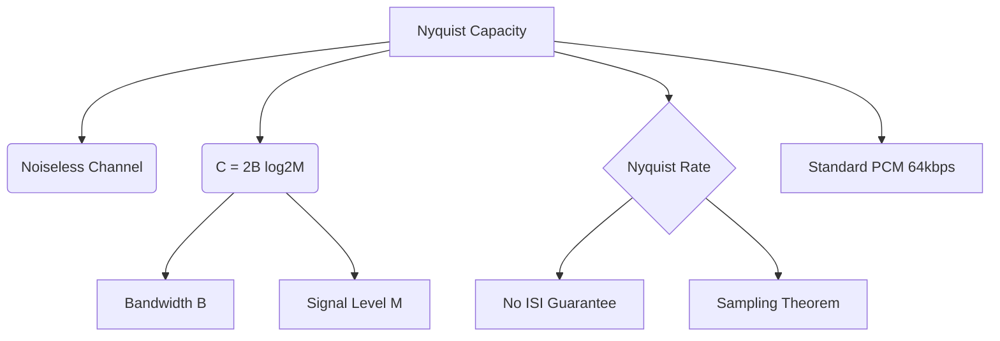

+++
title = "NW #20 나이퀴스트 채널 용량 (Nyquist Capacity) - 무잡음 채널"
date = 2026-03-14
[extra]
categories = "studynote-network"
+++

# NW #20 나이퀴스트 채널 용량 (Nyquist Capacity) - 무잡음 채널

> **핵심 인사이트**: 나이퀴스트(Nyquist) 채널 용량은 잡음이 없는 이상적인 상태에서 대역폭($B$)과 신호 레벨 수($M$)에 의해 결정되는 이론적 최대 데이터 전송률을 의미하며, 심볼 간 간섭(ISI) 없이 전송 가능한 통신 공학의 기초 한계를 제시한다.

---

## Ⅰ. 나이퀴스트 공식과 전송 메커니즘

해리 나이퀴스트(Harry Nyquist)는 대역폭이 $B$인 채널을 통해 신호를 보낼 때, 초당 최대 $2B$개의 심볼을 보낼 수 있다는 사실을 증명하였다.

### 1. 산출 공식
$$C = 2 \cdot B \cdot \log_{2}(M)$$

- $C$: 채널 용량 (Capacity, bps)
- $B$: 채널의 대역폭 (Bandwidth, Hz)
- $M$: 신호의 이산적 레벨(Level) 수 (예: Binary일 때 $M=2$, 16-QAM일 때 $M=16$)

### 2. 의미 분석
- **대역폭 비례**: $B$가 커지면 용량이 선형적으로 증가.
- **레벨 수 비례**: $M$을 늘려 심볼당 비트 수를 높이면 용량 증가.

```ascii
[ Multi-level Signal and Nyquist ]

    Level (M)           Signal Pulse           Bits per Symbol
    -----------------------------------------------------------
    M = 2 (Binary)      _|_|---|_|---          1 bit
    M = 4 (QPSK)        _|-|_|---|_|           2 bits
    M = 8 (8-PSK)       _|-|--|_|---           3 bits
    -----------------------------------------------------------
```

📢 **섹션 요약 비유**: 나이퀴스트 용량은 '도로의 폭(대역폭)이 정해졌을 때, 차선당 얼마나 많은 사람을 태운 버스(심볼 레벨)를 통과시킬 수 있는지'를 나타내는 한계치입니다.

---

## Ⅱ. 심볼 간 간섭 (ISI)과 나이퀴스트 속도

나이퀴스트 용량의 핵심 전제는 **ISI(Inter-Symbol Interference)**가 발생하지 않는 최대 속도를 찾는 것이다.

### 1. 나이퀴스트 레이트 (Nyquist Rate)
- 신호를 복원하기 위해 필요한 최소한의 표본화 속도 ($2B$).
- 이 속도를 초과하여 전송하면 신호 간 겹침 현상(Aliasing)이 발생하여 데이터 복원 불가.

### 2. 다단 변조 (M-ary Modulation)의 한계
- 이론적으로 $M$을 무한히 늘리면 용량도 무한히 늘어나야 하지만, 실제로는 잡음(Noise) 때문에 $M$을 무한정 늘릴 수 없다.

📢 **섹션 요약 비유**: 버스를 너무 가깝게 붙여서(속도 초과) 달리면 앞 버스와 뒷 버스가 엉켜서(ISI) 사고가 나는 것과 같습니다.

---

## Ⅲ. 나이퀴스트 공식의 실제적 적용 (PCM 사례)

나이퀴스트 정리는 아날로그 신호를 디지털로 바꾸는 **PCM(Pulse Code Modulation)** 과정에서 핵심적으로 쓰인다.

| 적용 단계 | 상세 내용 |
|:---:|:---|
| **Sampling** | 음성(4kHz)의 경우 2배인 8,000Hz로 샘플링 수행. |
| **Quantization** | $M$ 단계(예: 8bit = 256단계)로 신호 크기를 수치화. |
| **Data Rate** | $2 \times 4000 \times 8 = 64,000$ bps (64kbps, 표준 전화 품질). |

📢 **섹션 요약 비유**: 물결치는 소리를 사진으로 찍을 때, 1초에 최소 2번(2B) 이상 찍어야 원래 소리의 모양을 다시 그릴 수 있다는 규칙입니다.

---

## Ⅳ. 전문가 제언: 나이퀴스트에서 샤논으로

나이퀴스트 공식은 **'무잡음(Noiseless)'** 채널이라는 이상적인 가정하에 세워졌다. 하지만 현실의 통신 시스템은 항상 잡음이 존재하며, 잡음이 심할 경우 $M$ 레벨을 아무리 늘려도 신호를 구별할 수 없게 된다. 따라서 실제 네트워크 설계 시에는 나이퀴스트 공식을 통해 **'상한선'**을 확인하고, **샤논(Shannon)의 공식**을 통해 **'잡음 환경에서의 실질적 한계'**를 도출하는 통합적 접근이 필요하다.

---

## 💡 개념 맵 (Knowledge Graph)



---

## 👶 어린이 비유
- **나이퀴스트 규칙**: 깃발 신호(심볼)를 아주 빨리 흔들 때, 친구가 헷갈리지 않고 읽을 수 있는 '최고의 속도'예요.
- **깃발의 색깔(M)**: 깃발의 색깔이 많아지면 한 번에 더 많은 비밀 메시지를 보낼 수 있어요.
- **결론**: 깃발을 너무 빨리 흔들거나 색깔이 너무 복잡하면 친구가 "어지러워!" 하고 못 읽게 돼요. 그 직전의 가장 빠른 속도가 바로 나이퀴스트 속도랍니다!
