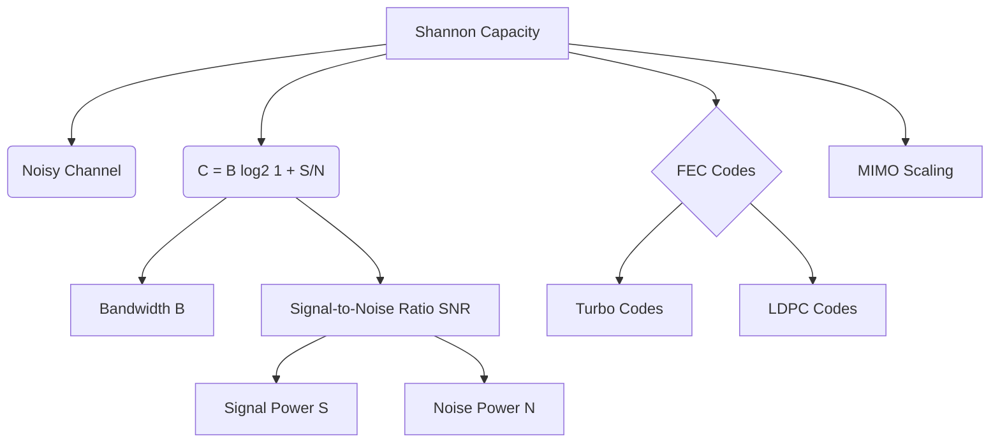

+++
title = "NW #21 샤논의 채널 용량 (Shannon Capacity) - 잡음 채널"
date = 2026-03-14
[extra]
categories = "studynote-network"
+++

# NW #21 샤논의 채널 용량 (Shannon Capacity) - 잡음 채널

> **핵심 인사이트**: 샤논(Shannon)의 채널 용량은 잡음(Noise)이 존재하는 실제 통신 환경에서 대역폭($B$)과 신호 대 잡음비(SNR)에 의해 결정되는 이론적 한계 속도로, 어떤 오류 정정 기법(FEC)을 써도 넘을 수 없는 데이터 전송의 **절대적 상한선**을 정의한다.

---

## Ⅰ. 샤논-하틀리(Shannon-Hartley) 공식의 메커니즘

클로드 샤논은 1948년 정보를 전달하는 채널의 용량이 대역폭과 신호 전력, 잡음 전력에 의해 제한됨을 수학적으로 증명하였다.

### 1. 산출 공식
$$C = B \cdot \log_{2}(1 + \frac{S}{N})$$

- $C$: 채널 용량 (Capacity, bps)
- $B$: 대역폭 (Bandwidth, Hz)
- $S/N$: 신호 대 잡음비 (SNR, Signal-to-Noise Ratio)

### 2. 특징 및 시사점
- **대역폭 비례**: $B$가 2배가 되면 용량도 2배가 됨 (선형적).
- **SNR 로그 비례**: $S/N$이 아무리 커져도 로그 스케일로 증가하여 한계(Diminishing returns)가 발생.
- **오류율**: 이 속도($C$) 이하로 전송하면 이론적으로 오류가 0에 수렴하도록 설계 가능.

```ascii
[ Capacity vs. Bandwidth and SNR ]

    Capacity (C)
      ^       /  High SNR (Fixed)
      |      /
      |     /  <--- Linear growth with Bandwidth
      |    /
      |   /  Low SNR (Fixed)
      |  /
      +------------------------> Bandwidth (B)
```

📢 **섹션 요약 비유**: 샤논 용량은 '카페가 시끄러울 때(잡음), 옆자리 친구의 말을 얼마나 정확하고 빠르게 알아들을 수 있는지'를 정하는 자연의 법칙입니다.

---

## Ⅱ. SNR(dB)과 채널 용량의 계산 관계

실제 현장에서는 $S/N$ 값을 데시벨(dB) 단위로 사용하므로 변환 과정이 필요하다.

### 1. dB와 배수의 관계
- $SNR(dB) = 10 \cdot \log_{10}(S/N)$
- 예: 20dB = 100배, 30dB = 1000배.

### 2. 계산 사례 (대역폭 3kHz, SNR 30dB 채널)
- $S/N$ 배수 = $10^{(30/10)} = 1000$.
- $C = 3,000 \cdot \log_{2}(1 + 1000) \approx 3,000 \cdot 10 \approx 30,000$ bps.
- 실제 전화선(3.4kHz)에서 28.8kbps~33.6kbps 모뎀 속도가 한계였던 이유이다.

📢 **섹션 요약 비유**: 목소리를 10배 크게(10dB) 키운다고 해서 대화 속도가 10배 빨라지는 것은 아닙니다. 귀로 구별할 수 있는 한계(Log)가 있기 때문입니다.

---

## Ⅲ. 현대 통신 기술의 샤논 한계 도전

무선 통신 공학의 역사는 샤논 한계에 더 가까이 다가가기 위한 여정이다.

| 기술 구분 | 핵심 전략 | 비고 |
|:---:|:---|:---|
| **터보 코드 / LDPC** | 샤논 한계에 근접하는 강력한 오류 정정(FEC) | LTE, 5G 표준 채택 |
| **MIMO (다중안테나)** | 공간 다중화로 $C$를 선형적으로 배수 증대 | $C = \min(N_t, N_r) \cdot B \log_2(1+SNR)$ |
| **적응형 변조(AM)** | 채널 SNR 상태에 따라 $M$ 레벨을 실시간 변경 | 채널 용량 활용도 극대화 |

```ascii
[ Shannon Boundary and Actual Codes ]

    Spectral Efficiency
      ^       |
      |       | 샤논 한계 (Shannon Limit)
      |       | <--- LDPC / Turbo Code (0.1~1dB gap)
      |       | <--- Convolutional Code
      |       | <--- No Coding (High BER)
      +------------------------> SNR (dB)
```

📢 **섹션 요약 비유**: 샤논 한계가 '100점 만점'이라면, 최신 통신 기술들은 99점(5G)까지 도달하여 더 이상 쥐어짤 것이 없는 극한의 상태입니다.

---

## Ⅳ. 전문가 제언: 6G 시대의 용량 증대 전략

이제 $S/N$을 높여서 용량을 늘리는 것은 로그 함수의 한계로 인해 효율이 매우 낮다. 따라서 차세대 6G 통신에서는 로그 밖의 변수인 **대역폭($B$)**을 획기적으로 늘리기 위해 테라헤르츠(THz) 대역으로 이동하거나, **공간 차원(MIMO)**을 수백 개로 늘려 전체 용량을 배수로 끌어올리는 전략을 취하고 있다. 즉, 시끄러운 카페에서 소리를 지르기보다(SNR), 아예 다른 방을 여러 개 잡는(MIMO/Broadband) 쪽으로 진화하고 있다.

---

## 💡 개념 맵 (Knowledge Graph)



---

## 👶 어린이 비유
- **샤논 아저씨의 규칙**: 운동장(대역폭)이 얼마나 넓은지, 그리고 응원 소리(잡음)가 얼마나 큰지에 따라 '선생님의 말소리'를 얼마나 빨리 들을 수 있는지 정해져 있다는 거예요.
- **운동장 넓이(B)**: 운동장이 넓을수록 아이들이 더 많이 뛰어놀 수 있어요.
- **조용할 때(SNR)**: 응원 소리가 작고 조용할수록 선생님의 말을 더 정확하고 빠르게 들을 수 있죠.
- **결론**: 아무리 귀가 좋아도 응원 소리가 너무 크면 말을 들을 수 없듯이, 모든 통신에는 절대 넘을 수 없는 '한계 속도'가 있답니다!
