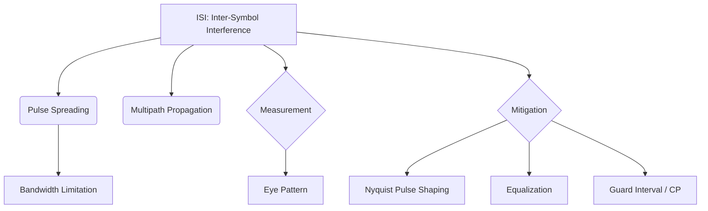

+++
title = "NW #22 심볼 상호 간섭 (ISI: Inter-Symbol Interference)"
date = 2026-03-14
[extra]
categories = "studynote-network"
+++

# NW #22 심볼 상호 간섭 (ISI: Inter-Symbol Interference)

> **핵심 인사이트**: 심볼 상호 간섭(ISI)은 인접한 데이터 심볼들이 전송 매체의 대역폭 제한이나 다중 경로(Multipath) 현상으로 인해 서로 겹쳐져 수신측에서 개별 비트를 정확히 판별하지 못하게 만드는 통신 장애 현상이다.

---

## Ⅰ. ISI의 발생 원인과 물리적 메커니즘

ISI는 주로 채널의 물리적 한계와 신호의 특성 때문에 발생한다.

### 1. 채널의 대역폭 제한 (Bandwidth Limitation)
- 모든 채널은 '저역 통과 필터(LPF)'의 특성을 가짐.
- 급격한 신호 변화(고주파)를 수용하지 못해 펄스의 에너지가 시간축으로 퍼짐(Pulse Spreading).

### 2. 다중 경로 페이딩 (Multipath Fading)
- 무선 환경에서 신호가 건물, 지형 등에 반사되어 여러 경로로 도착.
- 먼저 온 신호와 늦게 온 신호가 겹치면서 앞 심볼의 꼬리가 뒷 심볼을 덮어씀.

```ascii
[ Ideal vs. Real Pulse with ISI ]

    Ideal:   |---|   |---|   |---|  (Clean gaps)
             t1      t2      t3
    
    Real:    /---\_/---\_/---\_     (Spreading)
              \___/ \___/ \___/
                ^     ^
               ISI occurs here
```

📢 **섹션 요약 비유**: ISI는 '도화지에 잉크를 너무 촘촘하게 찍어서(고속 전송), 잉크가 번지면서 옆 점과 합쳐져 원래 글자를 알아볼 수 없게 되는 것'과 같습니다.

---

## Ⅱ. ISI 측정 및 시각화 도구: 아이 패턴 (Eye Pattern)

오실로스코프를 통해 신호를 겹쳐서 관찰하면 ISI의 정도를 직관적으로 파악할 수 있다.

### 1. 아이 패턴의 해석
- **눈의 뜨임(Opening)**: 눈이 크게 떠질수록 ISI가 적고 신뢰성이 높음.
- **눈의 닫힘**: ISI가 심해져 에러 발생 확률(BER)이 급격히 높아진 상태.

### 2. 주요 지표
- **지터 (Jitter)**: 수평축의 흔들림 (타이밍 오차).
- **노이즈 마진**: 수직축의 열림 정도 (진폭 판별 여유).

```ascii
[ Eye Pattern Diagram ]
      _______
     /   ^   \
    | Noise M |  <--- Wide open = Good
     \_______/
    /         \
   |  Jitter   | <--- Horizontal width
```

📢 **섹션 요약 비유**: 시력 검사를 할 때 눈을 크게 뜨면 글자가 잘 보이고(Low ISI), 눈을 찌푸리거나 흐릿하면 글자가 겹쳐 보이는 것(High ISI)과 같습니다.

---

## Ⅲ. ISI 해결을 위한 공학적 기술

| 기술 명칭 | 핵심 메커니즘 | 기대 효과 |
|:---:|:---|:---|
| **나이퀴스트 필터링** | Raised Cosine Filter 등을 사용하여 펄스 모양 성형 | 심볼 주기 $T$ 지점에서 진폭을 0으로 만들어 간섭 제거 |
| **등화기 (Equalizer)** | 수신측에서 채널의 왜곡 특성을 역으로 보상 | 뭉개진 펄스를 원래 모양으로 복원 |
| **가드 인터벌 (GI)** | 심볼 사이에 빈 공간(CP)을 삽입 | 앞 심볼의 잔상이 뒤를 덮지 않게 방어 (OFDM) |

```ascii
[ Guard Interval Concept ]
    
    Symbol 1 | GI | Symbol 2 | GI | Symbol 3
    <------>      <------>      <------>
      Data          Buffer        Data
```

📢 **섹션 요약 비유**: 글씨를 쓸 때 글자 사이를 조금씩 띄어 쓰거나(가드 인터벌), 번진 글씨를 지우개로 살살 닦아내는(등화기) 방법들입니다.

---

## Ⅳ. 전문가 제언: 초고속 통신에서의 ISI 관리

데이터 전송률이 Gbps 단위로 올라가면 심볼 주기가 극도로 짧아져 아주 미세한 반사파나 대역폭 제한도 치명적인 ISI를 유발한다. 특히 5G/6G의 **OFDM** 기술에서는 ISI를 막기 위해 **Cyclic Prefix(CP)**를 정교하게 설계하는 것이 핵심이다. 엔지니어는 단순한 신호 세기(SNR) 증폭보다, 시간축에서의 **심볼 동기화**와 **ISI 억제 성능**이 시스템의 실질적 처리량(Goodput)을 결정한다는 점을 명심해야 한다.

---

## 💡 개념 맵 (Knowledge Graph)



---

## 👶 어린이 비유
- **심볼 상호 간섭**: 스케치북에 물감으로 점을 찍는데, 너무 빨리 찍어서 물감이 옆으로 번져버리는 거예요.
- **결론**: 물감이 번지면 하트 모양인지 별 모양인지 알 수 없게 되죠? 그래서 물감을 말리면서 천천히 찍거나(가드 인터벌), 번지지 않는 펜(필터링)을 써야 한답니다!
