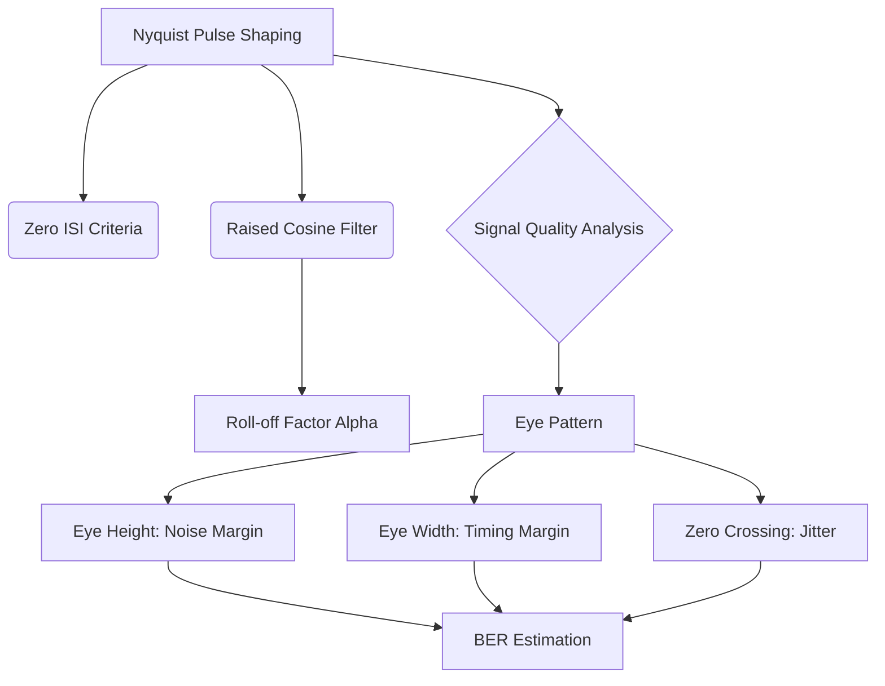

+++
title = "NW #23 나이퀴스트 펄스 포맷 및 아이패턴 (Eye Pattern)"
date = 2026-03-14
[extra]
categories = "studynote-network"
+++

# NW #23 나이퀴스트 펄스 포맷 및 아이패턴 (Eye Pattern)

> **핵심 인사이트**: 나이퀴스트 펄스 포맷은 심볼 간 간섭(ISI)을 최소화하기 위한 신호 성형 기술이며, 아이패턴(Eye Pattern)은 전송된 신호의 품질, 지터, 노이즈 내성을 오실로스코프 상에서 시각적으로 분석하는 가장 강력한 진단 도구이다.

---

## Ⅰ. 나이퀴스트 펄스 포맷 (Nyquist Pulse Shaping)

디지털 신호를 전송할 때, 직각형 펄스는 무한대의 대역폭을 요구하므로 실제 채널에서는 완만한 곡선 형태의 펄스로 성형(Shaping)해야 한다.

### 1. 나이퀴스트 제1기준 (Zero ISI)
- 특정 샘플링 시점($T$)에서 인접한 펄스의 진폭이 정확히 '0'이 되도록 설계하여 ISI를 제거하는 원리.

### 2. 레이즈드 코사인 필터 (Raised Cosine Filter)
- 대역폭 효율과 ISI 억제 사이의 균형을 맞추기 위해 롤오프 계수($\alpha$)를 적용한 필터.
- $\alpha = 0$: 이상적인 직각 필터 (구현 불가).
- $\alpha = 1$: 대역폭은 2배 필요하지만 ISI에 매우 강함.

```ascii
[ Pulse Shaping Concepts ]

    Ideal Rect Pulse       Raised Cosine Pulse (Alpha=0.5)
      |---|                   _..._
      |   |                  /     \
    --+---+-- f           --/-------\-- f
```

📢 **섹션 요약 비유**: 나이퀴스트 펄스 포맷은 '글씨를 쓸 때 다음 글자와 겹치지 않도록 글자의 꼬리를 아주 정교하게 다듬는 것'과 같습니다.

---

## Ⅱ. 아이패턴 (Eye Pattern)의 구조와 분석 지표

아이패턴은 수신된 신호를 심볼 주기 단위로 겹쳐서 그린 파형이다.

### 1. 주요 관찰 포인트
- **눈의 높이 (Eye Height)**: 수직 방향의 열림 정도. 잡음 여유도(Noise Margin)를 나타냄.
- **눈의 폭 (Eye Width)**: 수평 방향의 열림 정도. 샘플링 타이밍의 허용 오차를 나타냄.
- **눈의 교차점 (Zero-crossing)**: 지터(Jitter)의 정도를 측정하는 지점.

### 2. 신호 품질 판정
- **Open Eye**: 신호 품질 양호, 에러 확률(BER) 낮음.
- **Closed Eye**: ISI 및 잡음 심각, 데이터 복원 불가능.

```ascii
[ Eye Pattern Interpretation ]
      
      Top Rail  -------------------------
                 \        / ^  
                  \  Eye /  | Noise Margin (Height)
                   \____/   v 
                 /  ^   \ 
      Zero Cross <-----> Bottom Rail ----
                   Jitter (Width)
```

📢 **섹션 요약 비유**: 아이패턴은 '시력 검사표의 글자가 얼마나 또렷하게 보이는지 확인하는 눈'과 같습니다. 눈을 크게 뜰수록 글자를 정확히 읽을 수 있습니다.

---

## Ⅲ. 아이패턴을 통한 장애 진단 사례

| 관찰 현상 | 진단 결과 | 해결 방안 |
|:---:|:---|:---|
| **눈의 상하 폭 감소** | 신호 감쇄 또는 백색 잡음 증가 | 증폭기 추가, 송신 출력 향상 |
| **교차점의 좌우 흔들림** | 위상 지터(Jitter) 발생 | 클락 복구(Clock Recovery) 회로 개선 |
| **눈의 비대칭성** | 비선형 왜곡(Non-linear Distortion) | 등화기(Equalizer) 설정 최적화 |

📢 **섹션 요약 비유**: 눈이 위아래로 침침하면 안경(증폭기)이 필요하고, 눈이 좌우로 떨리면 휴식(클락 동기화)이 필요한 것과 같은 이치입니다.

---

## Ⅳ. 전문가 제언: 고속 직렬 인터페이스에서의 중요성

PCIe Gen5, DDR5, 800GbE와 같은 초고속 인터페이스 설계에서 아이패턴 분석은 선택이 아닌 필수이다. 신호의 전압 마진이 수십 mV에 불과한 환경에서는 아주 미세한 **심볼 간 간섭(ISI)**도 전체 시스템 다운을 유발할 수 있다. 따라서 설계 단계에서 **Pre-emphasis**나 **De-emphasis** 기술을 적용하여 아이패턴의 '눈'을 강제로 강하게 뜨게 만드는 기법들이 현대 하드웨어 엔지니어링의 핵심이다.

---

## 💡 개념 맵 (Knowledge Graph)



---

## 👶 어린이 비유
- **아이패턴**: 텔레비전 신호가 얼마나 '깨끗하게' 오는지 확인하는 '눈 모양' 지도예요.
- **예쁜 눈**: 눈이 동그랗고 크게 보이면 만화영화가 아주 잘 나오는 거예요.
- **찌그러진 눈**: 눈이 작아지거나 찌그러지면 화면이 지지직거리고 잘 안 보여요.
- **결론**: 눈을 크게 뜨게 만들어야(신호 정비) 우리가 재미있는 만화를 끊기지 않고 볼 수 있답니다!
