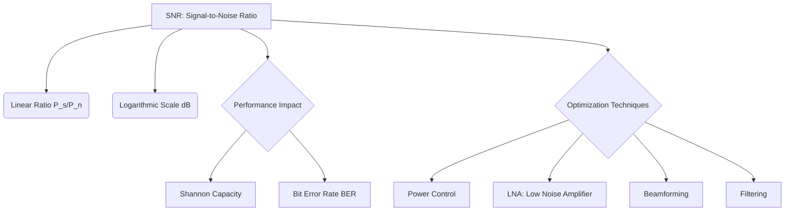

+++
title = "NW #24 신호 대 잡음비 (SNR, Signal-to-Noise Ratio)"
date = 2026-03-14
[extra]
categories = "studynote-network"
+++

# NW #24 신호 대 잡음비 (SNR, Signal-to-Noise Ratio)

> **핵심 인사이트**: 신호 대 잡음비(SNR)는 전송된 유효 신호 전력과 원치 않는 잡음 전력의 비율을 나타내며, 통신 시스템의 신뢰성, 데이터 전송률(샤논 한계), 그리고 오류율(BER)을 결정짓는 가장 근본적인 물리적 지표이다.

---

## Ⅰ. SNR의 정의와 산출 공식

SNR은 신호가 얼마나 잡음에 묻히지 않고 선명한지를 나타낸다.

### 1. 전력비 (Linear Scale)
$$SNR = \frac{P_{signal}}{P_{noise}}$$

### 2. 데시벨 (Logarithmic Scale, dB)
인간의 감각과 통신 공학적 편리함을 위해 상용 로그를 취하여 표현한다.
$$SNR(dB) = 10 \cdot \log_{10} \left( \frac{P_{signal}}{P_{noise}} \right)$$

```ascii
[ Signal and Noise Visualization ]

    Amplitude
      ^      _..._   <--- Useful Signal (S)
      |     /     \
      |  --/-------\--  <--- Noise Floor (N)
      |  ~~~~~~~~~~~~~~~~
      +------------------------> Time
```

📢 **섹션 요약 비유**: SNR은 '시끄러운 카페(잡음)에서 친구의 목소리(신호)가 얼마나 크게 들리는지'를 나타내는 비율입니다.

---

## Ⅱ. SNR이 통신 성능에 미치는 영향

### 1. 샤논 한계와의 관계 (Capacity)
- $C = B \log_2(1+SNR)$.
- SNR이 높을수록 동일 대역폭에서 더 많은 데이터를 실어 나를 수 있음.

### 2. 비트 에러율 (BER: Bit Error Rate)
- SNR이 낮아지면 신호와 잡음을 구별하지 못해 비트 반전(0→1, 1→0) 에러가 급증함.
- BER을 일정 수준으로 유지하기 위해 필요한 최소한의 SNR을 'Eb/No' 관점에서 관리함.

📢 **섹션 요약 비유**: 목소리가 작고 주변이 너무 시끄러우면(Low SNR), 친구의 말을 잘못 알아들어 엉뚱한 대답(에러)을 하게 되는 것과 같습니다.

---

## Ⅲ. SNR 향상을 위한 핵심 전략

| 전략 구분 | 상세 내용 | 기대 효과 |
|:---:|:---|:---|
| **송신 전력 강화** | 송신 안테나 출력(Watts)을 높임 | SNR 직접 상승 (단, 간섭 및 배터리 문제 발생) |
| **저잡음 증폭 (LNA)** | 수신측에서 잡음 유입을 최소화하며 신호 증폭 | Noise Floor 하강 효과 |
| **대역폭 제한** | 필요한 주파수만 필터링하여 통과 | 대역폭 비례 잡음($N_0B$) 유입 차단 |
| **다중 안테나 (MIMO)** | 빔포밍(Beamforming)을 통해 신호를 집중 | 특정 방향의 실질적 SNR 강화 |

```ascii
[ SNR Improvement: Beamforming ]

      Omni:  (   Router   )  <-- Signal spreads out
    
      Beam:  Router =======> Device  <-- Signal concentrated
```

📢 **섹션 요약 비유**: 친구 목소리를 더 잘 듣기 위해 '확성기를 쓰거나(전력 강화)', '귀에 손을 모아 듣거나(빔포밍)', '귀마개를 해서 주변 소리를 막는(필터링)' 방법들입니다.

---

## Ⅳ. 전문가 제언: SNR vs SINR (실제 환경의 차이)

실제 이동통신(LTE/5G) 환경에서는 순수 잡음($N$)뿐만 아니라 타 기지국에서 오는 **간섭($I$)**이 더 큰 문제가 된다. 이를 **SINR (Signal to Interference plus Noise Ratio)**이라 부르며, 현대 네트워크 엔지니어는 단순 SNR 최적화보다 **간섭 제어(ICIC)**를 통해 SINR을 확보하는 데 더 많은 노력을 기울여야 한다. 신호가 아무리 강해도 옆집 라디오 소리(간섭)가 더 크면 통신은 불가능하기 때문이다.

---

## 💡 개념 맵 (Knowledge Graph)



---

## 👶 어린이 비유
- **신호(친구 목소리)**: 내가 듣고 싶은 맛있는 사탕 이야기예요.
- **잡음(바람 소리)**: 쌩쌩 부는 방해꾼 바람 소리예요.
- **SNR**: 바람 소리보다 친구 목소리가 얼마나 더 큰지를 나타내요.
- **결론**: 친구 목소리가 아주 커야(High SNR) 사탕 이야기를 정확하게 다 들을 수 있답니다!
