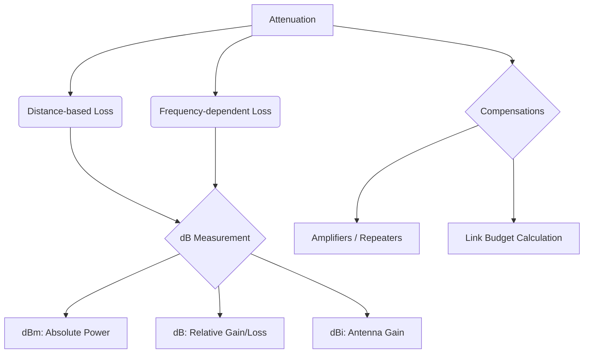

+++
title = "NW #25 감쇠 (Attenuation) 및 데시벨(dB) 측정"
date = 2026-03-14
[extra]
categories = "studynote-network"
+++

# NW #25 감쇠 (Attenuation) 및 데시벨(dB) 측정

> **핵심 인사이트**: 감쇠(Attenuation)는 신호가 전송 매체를 통과하면서 물리적 거리와 주파수 특성에 의해 에너지를 잃고 세기가 약해지는 현상이며, 데시벨(dB)은 이러한 신호의 변화량을 로그 스케일로 정교하게 측정하는 통신 공학의 핵심 단위이다.

---

## Ⅰ. 신호 감쇠 (Attenuation)의 원인과 특성

신호는 매체 내의 저항, 산란, 흡수 등의 이유로 거리가 멀어질수록 감쇠된다.

### 1. 주요 감쇠 요인
- **매체 저항 (Ohmic Loss)**: 구리선 내의 전기 저항으로 인한 열 에너지 발산.
- **흡수 및 산란 (Absorption/Scattering)**: 광섬유 내부의 불순물이나 유리 분자에 의한 빛의 산란.
- **주파수 의존성**: 일반적으로 주파수가 높을수록 감쇠가 더 심함 (Skin effect).

### 2. 감쇠 지수 ($\alpha$)
- 단위 거리당 손실되는 전력량 ($dB/km$).

```ascii
[ Attenuation Trend ]

    Signal Power (P)
      ^
      | P_in (Source)
      |  \
      |   \
      |    \----... (Attenuation over distance)
      |          \
      |           \ P_out (Destination)
      +------------------------> Distance (km)
```

📢 **섹션 요약 비유**: 감쇠는 '멀리서 부르는 소리가 공기에 막혀 점점 작게 들리는 것'과 같습니다. 거리가 멀어질수록 소리(신호)는 힘을 잃습니다.

---

## Ⅱ. 데시벨(dB) 측정 체계의 이해

데시벨은 두 값의 비율을 로그로 표현한 것으로, 매우 큰 전력 변화를 작은 수치로 다루기 위해 사용한다.

### 1. 기본 공식
- **전력(Power) 비**: $Gain/Loss (dB) = 10 \cdot \log_{10} \left( \frac{P_{out}}{P_{in}} \right)$
- **전압(Voltage) 비**: $Gain/Loss (dB) = 20 \cdot \log_{10} \left( \frac{V_{out}}{V_{in}} \right)$

### 2. 주요 기준 단위 (Reference Units)
| 단위 | 기준값 | 용도 |
|:---:|:---|:---|
| **dBm** | 1mW ($10^{-3}W$) | 절대적 전력 측정 (무선 안테나 출력 등) |
| **dBW** | 1W | 대출력 장비 측정 |
| **dBi** | Isotropic Antenna (등방성) | 안테나 이득(Gain) 측정 |

📢 **섹션 요약 비유**: 숫자가 너무 크면 읽기 힘들어서, '10배는 1단계(10dB), 100배는 2단계(20dB)' 식으로 압축해서 부르는 별명입니다.

---

## Ⅲ. 감쇠 보상 및 링크 마진 (Link Budget)

네트워크 설계 시 수신측에서 감쇠된 신호를 복원하기 위해 **Link Budget**을 계산한다.

| 구성 요소 | 영향 | 비고 |
|:---:|:---|:---|
| **송신 출력 ($P_{tx}$)** | (+) 이득 | dBm 단위 |
| **케이블 손실 ($L_{cable}$)** | (-) 감쇠 | 거리에 비례 ($dB/m$) |
| **커넥터 손실 ($L_{conn}$)** | (-) 감쇠 | 접속 부위마다 발생 |
| **리피터 / 증폭기** | (+) 이득 | 감쇠된 신호를 재생/증폭 |
| **수신 감도 ($S_{rx}$)** | 기준선 | 신호가 이 값보다 커야 수신 가능 |

```ascii
[ Link Budget Calculation ]

    P_tx ----(Loss)---- [ Repeater ] ----(Loss)----> P_rx (Must > Sensitivity)
    +10dBm   -5dB        +20dB Gain      -20dB       +5dBm (OK)
```

📢 **섹션 요약 비유**: 목적지까지 가는 데 기름이 얼마나 들지(감쇠) 계산하고, 중간에 주유소(증폭기)를 어디에 세울지 정하는 계획서입니다.

---

## Ⅳ. 전문가 제언: 주파수 대역 선정의 딜레마

5G 28GHz(mmWave)가 3.5GHz보다 속도는 빠르지만 상용화에 어려움을 겪는 이유는 **고주파의 심한 감쇠 특성** 때문이다. 주파수가 높을수록 직진성은 강해지나 비, 안개, 건물 벽 등에 의한 감쇠가 급격히 커져 도달 거리가 짧아진다. 따라서 엔지니어는 **대역폭(속도)**과 **감쇠(커버리지)** 사이의 최적점을 찾아 네트워크 토폴로지를 설계하는 통찰력이 필요하다.

---

## 💡 개념 맵 (Knowledge Graph)



---

## 👶 어린이 비유
- **감쇠**: 건전지로 가는 장난감 기차가 멀리 갈수록 힘이 빠져서 천천히 가는 거예요.
- **데시벨(dB)**: 기차의 힘이 얼마나 빠졌는지 숫자로 적어놓은 장부예요.
- **증폭기**: 힘이 빠진 기차에게 중간에 새 건전지를 끼워주는 정거장이에요.
- **결론**: 기차가 멈추지 않고 끝까지 가려면, 힘이 얼마나 빠질지 미리 알고 정거장을 잘 만들어야 한답니다!
