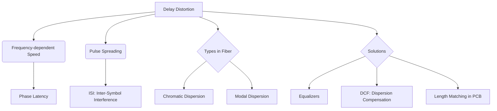

+++
title = "NW #26 지연 왜곡 (Delay Distortion)"
date = 2026-03-14
[extra]
categories = "studynote-network"
+++

# NW #26 지연 왜곡 (Delay Distortion)

> **핵심 인사이트**: 지연 왜곡(Delay Distortion)은 전송 매체 내에서 신호를 구성하는 다양한 주파수 성분들이 각기 다른 속도로 이동함으로써 발생하는 파형의 뭉개짐 현상이며, 주로 유선 매체(구리선 등)의 물리적 특성에 의해 발생하여 인접 심볼 간 간섭(ISI)의 원인이 된다.

---

## Ⅰ. 지연 왜곡의 발생 메커니즘

신호는 하나의 주파수가 아니라 여러 주파수 성분의 합으로 이루어진다.

### 1. 주파수별 속도 차이
- 전송 매체(매질) 내에서 전파 속도는 주파수에 따라 미세하게 다르다.
- 유선 채널의 경우, 중심 주파수 근처의 속도가 가장 빠르고 양 끝단 주파수의 속도가 느려지는 경향이 있다.

### 2. 위상 지연 (Phase Delay)의 누적
- 주파수 성분들이 목적지에 각기 다른 시간에 도착하면서 원래의 합성 파형이 무너진다.
- 펄스의 에너지가 시간축으로 퍼져 인접한 패킷/심볼 영역을 침범한다.

```ascii
[ Delay Distortion Visualization ]

    Input Signal (Perfect Pulse)       Output Signal (Distorted)
          _____                             _..._
         |     |                           /     \
    -----|     |-----  ----(Media)---->  -/-------\-
         |_____|                        (Spreading)
```

📢 **섹션 요약 비유**: 지연 왜곡은 '키가 다른 친구들이 손을 잡고 달리는데(신호), 어떤 친구는 빠르고 어떤 친구는 느려서 결국 손이 놓이고 줄이 엉망이 되는 것'과 같습니다.

---

## Ⅱ. 지연 왜곡과 분산 (Dispersion)

지연 왜곡은 특히 광통신에서 **'분산(Dispersion)'**이라는 용어로 심도 있게 다루어진다.

| 분산 종류 | 발생 원인 | 영향 |
|:---:|:---|:---|
| **모드 분산 (Modal)** | 다중 모드 광섬유에서 빛의 반사 각도 차이 | 장거리 전송 제한 |
| **색 분산 (Chromatic)** | 빛의 파장(색상)별 굴절률 차이 | 고속 통신에서 펄스 겹침 유발 |
| **편파 모드 분산 (PMD)** | 광섬유의 비대칭성으로 인한 편파 간 속도 차이 | 초고속(100G 이상) 통신 장애 |

📢 **섹션 요약 비유**: 빛의 색깔마다 속도가 달라서 무지개가 번지는 것처럼, 데이터 신호도 파장마다 속도가 달라져 번지는 현상입니다.

---

## Ⅲ. 지연 왜곡의 영향 및 해결 기술

### 1. 주요 영향: 심볼 간 간섭 (ISI)
- 지연 왜곡으로 인해 퍼진 파형이 다음 비트의 판독을 방해하여 에러율(BER)을 상승시킴.

### 2. 해결 기술 (Compensations)
- **등화기 (Equalizer)**: 수신측에서 주파수별 지연 시간을 역으로 계산하여 보상함.
- **분산 보상 광섬유 (DCF)**: 역분산 특성을 가진 케이블을 연결하여 파형을 다시 모음.
- **보호 대역 (Guard Interval)**: 심볼 사이에 충분한 시간 간격을 두어 왜곡된 파형이 겹치지 않게 함.

```ascii
[ Equalization Effect ]

    Distorted Signal ----> [ Equalizer ] ----> Restored Signal
        _..._                                     _____
       /     \           (Reverse Delay)         |     |
      /       \          (Processing)            |     |
```

📢 **섹션 요약 비유**: 엉망이 된 대열을 '뒤처진 친구들을 앞으로 당기고 빠른 친구를 잠시 멈추게 해서(등화기)' 다시 나란히 줄을 세우는 방법입니다.

---

## Ⅳ. 전문가 제언: 디지털 설계에서의 고려사항

현대 고속 디지털 회선 설계에서는 지연 왜곡이 단순한 노이즈보다 더 무서운 적이다. 특히 기판(PCB) 설계 시 구리 배선의 길이를 1mm 단위로 맞추는 **'Length Matching'**은 전선 내에서의 미세한 지연 차이를 없애기 위한 기초 작업이다. 주파수가 올라갈수록 매체의 비선형적 지연 특성은 심해지므로, 설계 초기 단계부터 시뮬레이션을 통해 **전송선로(Transmission Line)**의 특성 임피던스와 전파 지연을 정밀하게 관리해야 한다.

---

## 💡 개념 맵 (Knowledge Graph)



---

## 👶 어린이 비유
- **지연 왜곡**: 노래를 부를 때 저음과 고음이 같은 속도로 들려야 하는데, 고음만 늦게 들려서 노래가 이상하게 들리는 거예요.
- **번짐**: 소리가 예쁘게 들리지 않고 웅웅거리며 옆 노래랑 섞여버려요.
- **결론**: 모든 소리가 똑같은 속도로 예쁘게 가도록 길을 잘 닦아주거나, 늦은 소리를 기다려줘야 노래를 잘 들을 수 있답니다!
