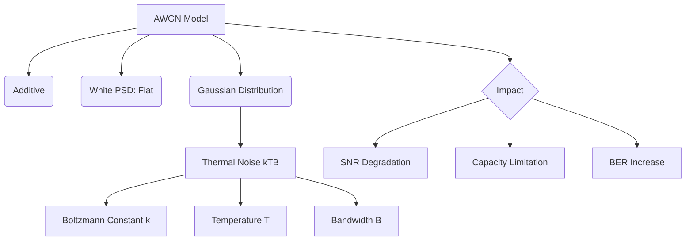

+++
title = "NW #27 백색 잡음 (White Noise) 및 가우스 잡음"
date = 2026-03-14
[extra]
categories = "studynote-network"
+++

# NW #27 백색 잡음 (White Noise) 및 가우스 잡음

> **핵심 인사이트**: 백색 잡음(White Noise)은 모든 주파수 대역에 걸쳐 균일한 전력 밀도를 가지는 잡음이며, 자연계의 열 잡음(Thermal Noise)과 같이 통신 시스템 전반에 걸쳐 불가피하게 존재하는 확률적 배경 소음이다.

---

## Ⅰ. 백색 잡음 (White Noise)의 정의와 물리적 특징

'백색(White)'이라는 명칭은 가시광선의 모든 색이 섞이면 흰색이 되듯, 모든 주파수 성분이 균등하게 포함되어 있다는 의미에서 유래하였다.

### 1. 전력 스펙트럼 밀도 (PSD: Power Spectral Density)
- 모든 주파수 대역에서 전력 밀도가 일정하다 ($N_0/2$).
- 즉, 특정 주파수를 선호하지 않는 무작위 잡음이다.

### 2. 가우스 잡음 (Gaussian Noise)
- 시간 영역에서의 진폭 분포가 **'가우시안 정규 분포'**를 따르는 잡음이다.
- 평균이 0이고 표준 편차 $\sigma$를 중심으로 데이터가 집중된다.

```ascii
[ White Noise in Time and Frequency ]

    Time Domain (Random)      Freq Domain (Flat)
       Amplitude                  Power (N)
         ^                          ^
         |  ~|~|~|~|~|~             |  ---------- N_0/2
         |  ~|~|~|~|~|~             |  
    -----+------------> t      -----+------------> f
```

📢 **섹션 요약 비유**: 백색 잡음은 '오래된 TV 화면의 소음(치지직)'이나 '비어 있는 라디오 주파수의 소리'처럼 전 대역에 깔려 있는 배경 소음과 같습니다.

---

## Ⅱ. AWGN (Additive White Gaussian Noise) 모델

통신 이론에서 가장 널리 쓰이는 표준 잡음 모델이다.

### 1. 특징
- **Additive (가산적)**: 신호에 더해짐 (Signal + Noise).
- **White (백색)**: 전 대역에 균일하게 존재.
- **Gaussian (가우시안)**: 정규 분포를 따름.

### 2. 열 잡음 (Thermal Noise)
- 도체 내 전자의 불규칙한 열 운동에 의해 발생하며 AWGN의 주요 원인이다.
- $N = k \cdot T \cdot B$
  - $k$: 볼츠만 상수
  - $T$: 절대 온도 (K)
  - $B$: 대역폭 (Hz) → 대역폭을 넓게 잡을수록 유입되는 잡음 전력도 커짐.

📢 **섹션 요약 비유**: 조용한 숲속(진공)에서도 나뭇잎 흔들리는 소리(열 잡음)는 항상 들리듯이, 모든 전자기기는 온도가 있는 한 항상 이 잡음을 가지고 있습니다.

---

## Ⅲ. 백색 잡음이 통신 시스템에 미치는 영향

| 구분 | 영향 내용 | 비고 |
|:---:|:---|:---|
| **오류율 (BER)** | 신호 레벨 판별을 방해하여 비트 오류 유발 | SNR 감소의 주범 |
| **샤논 한계** | 채널 용량 $C$를 결정하는 분모($N$) 역할 | $C = B \log_2(1 + S/N)$ |
| **필터링 필요성** | 대역 외 잡음을 차단하기 위한 LPF 필수 | 불필요한 대역의 잡음 유입 방지 |

📢 **섹션 요약 비유**: 선생님의 목소리를 듣는데 교실 밖의 소음(백색 잡음)이 섞이면 집중력이 떨어지고(SNR 저하) 말을 놓치게(에러) 되는 것과 같습니다.

---

## Ⅳ. 전문가 제언: 잡음 지수(NF)와 링크 설계

엔지니어는 시스템의 **잡음 지수(Noise Figure, NF)**를 관리해야 한다. 송신 전력을 높이는 데는 한계가 있으므로, 수신측에서 발생하는 AWGN을 최소화하는 설계가 더 중요하다. 특히 대역폭($B$)을 2배 늘리면 유입되는 백색 잡음 전력도 2배(3dB) 늘어난다는 점을 기억해야 한다. 초고속 광대역 통신으로 갈수록 신호 전력은 넓게 펴지는데 잡음은 그대로이므로, 더 정교한 **오류 정정(FEC)** 기술과 **저잡음 증폭기(LNA)**가 시스템의 성능을 좌우하게 된다.

---

## 💡 개념 맵 (Knowledge Graph)



---

## 👶 어린이 비유
- **백색 잡음**: 라디오 채널이 안 맞을 때 들리는 "치익~" 하는 소리예요.
- **가우스 잡음**: 이 소리의 크기가 갑자기 확 커지지는 않고, 대부분 비슷한 크기로 들리는 자연스러운 소음이에요.
- **결론**: 이 소리는 기계가 켜져 있으면 항상 나기 때문에, 우리가 보내는 신호(목소리)를 이 소리보다 아주 크게 만들어야 상대방이 잘 들을 수 있답니다!
